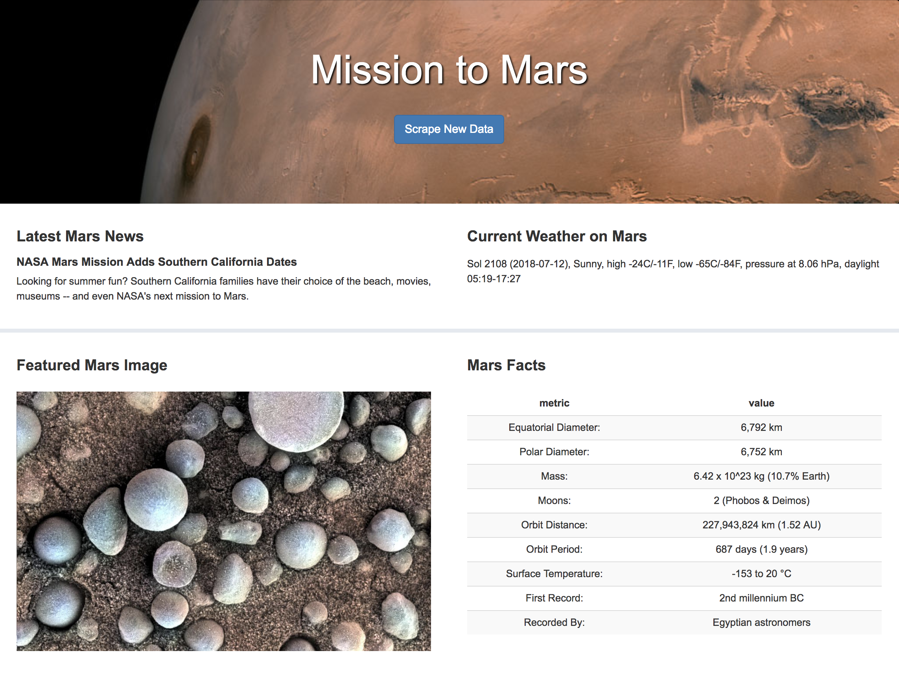
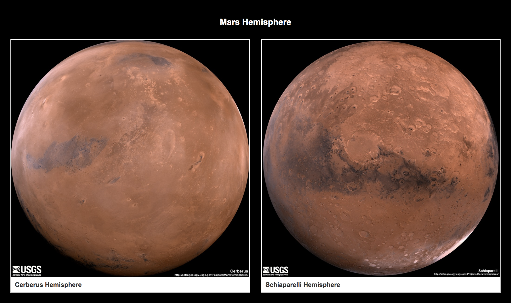
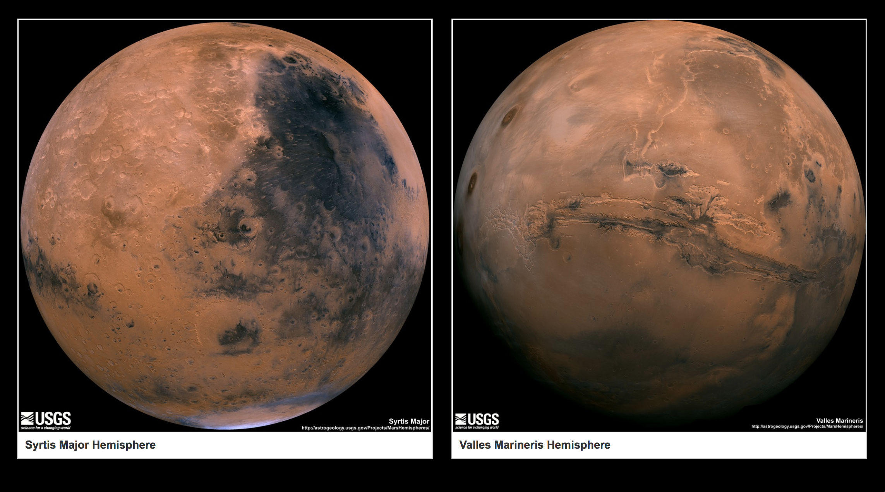

# Mission to Mars

A web application that scrapes various websites for data related to the Mission to Mars, stores scraped data in MongoDB, and displays the latest information in a single HTML page.

## Step 1 - Scraping

`mission_to_mars.ipynb`: the Jupyter Notebook file that outlines all the scraping. Python libraries used: BeautifulSoup, Pandas, and Splinter

* Scrape latest news title and paragraph text from the [NASA Mars News Site](https://mars.nasa.gov/news/).
* Scrape the image url for the current featured Mars Image from [JPL Featured Space Image](https://www.jpl.nasa.gov/spaceimages/?search=&category=Mars).
* Scrape the latest Mars weather tweet from the [Mars Weather twitter account](https://twitter.com/marswxreport?lang=en) 
* Scrape Mars metrics (e.g. diameter, mass) from the [Mars Facts webpage](http://space-facts.com/mars/).
* Scrape Mars hemispheres images and names from the [USGS Astrogeology site](https://astrogeology.usgs.gov/search/results?q=hemisphere+enhanced&k1=target&v1=Mars).

## Step 2 - MongoDB and Flask Application

`scrape_mars.py`: declares a function called `scrape` that executes all the above scraping and returns the scraped data.

`app.py`: creates an app route called `/scrape` that calls the `scrape` function and store data in Mongo database; creates a root route `/` that queries the Mongo database and pass the mars data into an HTML template to display the data.

`index.html`: a template HTML file that display all data in the appropriate HTML elements.

## Webpage Screenshots

Screenshot 1:

Screenshot 2:

Screenshot 3:
