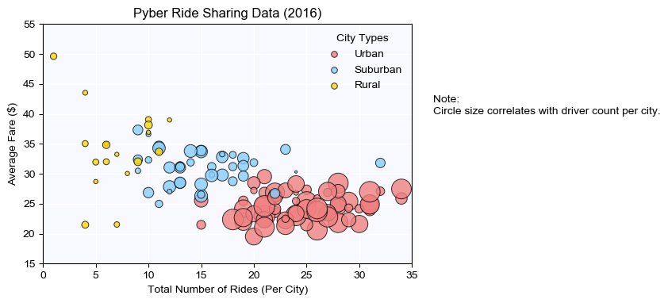
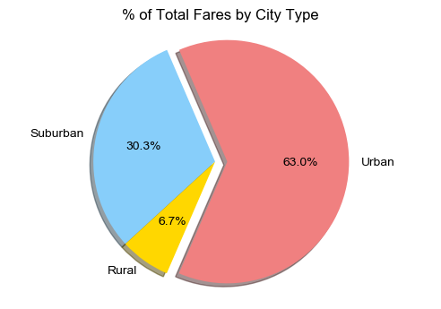
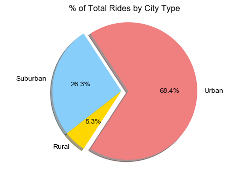
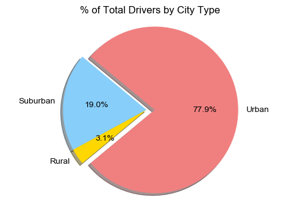

### Pyber Analysis
* **Observed Trend 1:** From rural to suburban to urban cities, the average fare per ride is less, but there are more rides and more drivers.
* **Observed Trend 2:** Urban cities account for the majority of total fares, total number of rides, and total number of drivers.
* **Observed Trend 3:** Rural areas, despite of their relatively high average fare, have a small share of the total fares, total number of rides, and total number of drivers.


```python
import pandas as pd
import matplotlib.pyplot as plt
import numpy as np
import matplotlib as mpl
```

### Read data


```python
city = pd.read_csv('raw_data/city_data.csv')
ride = pd.read_csv('raw_data/ride_data.csv')
```

* Remove duplicated entry in city data


```python
index_to_remove = city.loc[(city['city']=='Port James') & (city['driver_count']==3)].index
city = city.drop(index_to_remove)
```


```python
city.head()
```


<div>
<style scoped>
    .dataframe tbody tr th:only-of-type {
        vertical-align: middle;
    }

    .dataframe tbody tr th {
        vertical-align: top;
    }

    .dataframe thead th {
        text-align: right;
    }
</style>
<table border="1" class="dataframe">
  <thead>
    <tr style="text-align: right;">
      <th></th>
      <th>city</th>
      <th>driver_count</th>
      <th>type</th>
    </tr>
  </thead>
  <tbody>
    <tr>
      <th>0</th>
      <td>Kelseyland</td>
      <td>63</td>
      <td>Urban</td>
    </tr>
    <tr>
      <th>1</th>
      <td>Nguyenbury</td>
      <td>8</td>
      <td>Urban</td>
    </tr>
    <tr>
      <th>2</th>
      <td>East Douglas</td>
      <td>12</td>
      <td>Urban</td>
    </tr>
    <tr>
      <th>3</th>
      <td>West Dawnfurt</td>
      <td>34</td>
      <td>Urban</td>
    </tr>
    <tr>
      <th>4</th>
      <td>Rodriguezburgh</td>
      <td>52</td>
      <td>Urban</td>
    </tr>
  </tbody>
</table>
</div>


```python
ride.head()
```


<div>
<style scoped>
    .dataframe tbody tr th:only-of-type {
        vertical-align: middle;
    }

    .dataframe tbody tr th {
        vertical-align: top;
    }

    .dataframe thead th {
        text-align: right;
    }
</style>
<table border="1" class="dataframe">
  <thead>
    <tr style="text-align: right;">
      <th></th>
      <th>city</th>
      <th>date</th>
      <th>fare</th>
      <th>ride_id</th>
    </tr>
  </thead>
  <tbody>
    <tr>
      <th>0</th>
      <td>Sarabury</td>
      <td>2016-01-16 13:49:27</td>
      <td>38.35</td>
      <td>5403689035038</td>
    </tr>
    <tr>
      <th>1</th>
      <td>South Roy</td>
      <td>2016-01-02 18:42:34</td>
      <td>17.49</td>
      <td>4036272335942</td>
    </tr>
    <tr>
      <th>2</th>
      <td>Wiseborough</td>
      <td>2016-01-21 17:35:29</td>
      <td>44.18</td>
      <td>3645042422587</td>
    </tr>
    <tr>
      <th>3</th>
      <td>Spencertown</td>
      <td>2016-07-31 14:53:22</td>
      <td>6.87</td>
      <td>2242596575892</td>
    </tr>
    <tr>
      <th>4</th>
      <td>Nguyenbury</td>
      <td>2016-07-09 04:42:44</td>
      <td>6.28</td>
      <td>1543057793673</td>
    </tr>
  </tbody>
</table>
</div>


### Calculate metrics for each city
* Average Fare ($) Per City
* Total Number of Rides Per City


```python
grouper = ride.groupby(['city'])
metrics_ride = pd.DataFrame()
metrics_ride['average fare'] = grouper['fare'].mean()
metrics_ride['ride count'] = grouper['ride_id'].count()
metrics_ride = metrics_ride.reset_index()
metrics_ride.head()
```


<div>
<style scoped>
    .dataframe tbody tr th:only-of-type {
        vertical-align: middle;
    }

    .dataframe tbody tr th {
        vertical-align: top;
    }

    .dataframe thead th {
        text-align: right;
    }
</style>
<table border="1" class="dataframe">
  <thead>
    <tr style="text-align: right;">
      <th></th>
      <th>city</th>
      <th>average fare</th>
      <th>ride count</th>
    </tr>
  </thead>
  <tbody>
    <tr>
      <th>0</th>
      <td>Alvarezhaven</td>
      <td>23.928710</td>
      <td>31</td>
    </tr>
    <tr>
      <th>1</th>
      <td>Alyssaberg</td>
      <td>20.609615</td>
      <td>26</td>
    </tr>
    <tr>
      <th>2</th>
      <td>Anitamouth</td>
      <td>37.315556</td>
      <td>9</td>
    </tr>
    <tr>
      <th>3</th>
      <td>Antoniomouth</td>
      <td>23.625000</td>
      <td>22</td>
    </tr>
    <tr>
      <th>4</th>
      <td>Aprilchester</td>
      <td>21.981579</td>
      <td>19</td>
    </tr>
  </tbody>
</table>
</div>


* Total Number of Drivers Per City
* City Type (Urban, Suburban, Rural)


```python
metrics = pd.merge(metrics_ride, city, how='inner', on='city')
metrics = metrics.set_index('type').rename(columns={'driver_count':'driver count'})
metrics.head()
```


<div>
<style scoped>
    .dataframe tbody tr th:only-of-type {
        vertical-align: middle;
    }

    .dataframe tbody tr th {
        vertical-align: top;
    }

    .dataframe thead th {
        text-align: right;
    }
</style>
<table border="1" class="dataframe">
  <thead>
    <tr style="text-align: right;">
      <th></th>
      <th>city</th>
      <th>average fare</th>
      <th>ride count</th>
      <th>driver count</th>
    </tr>
    <tr>
      <th>type</th>
      <th></th>
      <th></th>
      <th></th>
      <th></th>
    </tr>
  </thead>
  <tbody>
    <tr>
      <th>Urban</th>
      <td>Alvarezhaven</td>
      <td>23.928710</td>
      <td>31</td>
      <td>21</td>
    </tr>
    <tr>
      <th>Urban</th>
      <td>Alyssaberg</td>
      <td>20.609615</td>
      <td>26</td>
      <td>67</td>
    </tr>
    <tr>
      <th>Suburban</th>
      <td>Anitamouth</td>
      <td>37.315556</td>
      <td>9</td>
      <td>16</td>
    </tr>
    <tr>
      <th>Urban</th>
      <td>Antoniomouth</td>
      <td>23.625000</td>
      <td>22</td>
      <td>21</td>
    </tr>
    <tr>
      <th>Urban</th>
      <td>Aprilchester</td>
      <td>21.981579</td>
      <td>19</td>
      <td>49</td>
    </tr>
  </tbody>
</table>
</div>


### Bubble Plot of Ride Sharing Data


```python
mpl.rcParams['figure.dpi']= 100
mpl.rcParams['font.family'] = 'sans-serif'
mpl.rcParams['font.sans-serif'] = ['Arial']
ax = metrics.loc['Urban'].plot.scatter(x='ride count', y='average fare', color='lightcoral', 
                                  edgecolors='black', linewidths=0.7, alpha=0.8,
                                  s=metrics.loc['Urban','driver count']*5, label='Urban')
metrics.loc['Suburban'].plot.scatter(x='ride count', y='average fare', color='lightskyblue', 
                                  edgecolors='black', linewidths=0.7, alpha=0.8,
                                  s=metrics.loc['Suburban','driver count']*5, label='Suburban', ax=ax)
metrics.loc['Rural'].plot.scatter(x='ride count', y='average fare', color='gold', 
                                  edgecolors='black', linewidths=0.7, alpha=0.8,
                                  s=metrics.loc['Rural','driver count']*5, label='Rural', ax=ax)

ax.set_facecolor('ghostwhite')
ax.text(37, 40, "Note:\nCircle size correlates with driver count per city.")
plt.xlim((0, 35))
plt.ylim((15, 55))
plt.xlabel('Total Number of Rides (Per City)')
plt.ylabel('Average Fare ($)')
plt.title('Pyber Ride Sharing Data (2016)')
lgnd = plt.legend(labels=['Urban', 'Suburban', 'Rural'], title='City Types', loc='best', frameon=False)
lgnd.legendHandles[0]._sizes = [30]
lgnd.legendHandles[1]._sizes = [30]
lgnd.legendHandles[2]._sizes = [30]
ax.grid(color='w', linestyle='-', linewidth=1)
ax.set_axisbelow(True)
```





### Calculate metrics grouped by city type
* % of Total Fares by City Type
* % of Total Rides by City Type
* % of Total Drivers by City Type


```python
metrics['total fares'] = metrics['average fare'] * metrics['ride count']
grouper_type = metrics.groupby([metrics.index])

metrics_type = pd.DataFrame()
metrics_type['total fares'] = grouper_type['total fares'].sum()
metrics_type['total rides'] = grouper_type['ride count'].sum()
metrics_type['total drivers'] = grouper_type['driver count'].sum()
metrics_type = metrics_type.reindex(['Urban', 'Suburban', 'Rural'])
metrics_type.head()
```


<div>
<style scoped>
    .dataframe tbody tr th:only-of-type {
        vertical-align: middle;
    }

    .dataframe tbody tr th {
        vertical-align: top;
    }

    .dataframe thead th {
        text-align: right;
    }
</style>
<table border="1" class="dataframe">
  <thead>
    <tr style="text-align: right;">
      <th></th>
      <th>total fares</th>
      <th>total rides</th>
      <th>total drivers</th>
    </tr>
    <tr>
      <th>type</th>
      <th></th>
      <th></th>
      <th></th>
    </tr>
  </thead>
  <tbody>
    <tr>
      <th>Urban</th>
      <td>40078.34</td>
      <td>1625</td>
      <td>2607</td>
    </tr>
    <tr>
      <th>Suburban</th>
      <td>19317.88</td>
      <td>625</td>
      <td>635</td>
    </tr>
    <tr>
      <th>Rural</th>
      <td>4255.09</td>
      <td>125</td>
      <td>104</td>
    </tr>
  </tbody>
</table>
</div>


### Pie plot by city type
* Total Fares by City Type


```python
metrics_type['total fares'].plot.pie(startangle=-113.4, colors=['lightcoral', 'lightskyblue', 'gold'],
                                    autopct='%1.1f%%', shadow=True, explode=[0.1, 0, 0])
plt.axis('equal')
plt.ylabel('')
plt.title('% of Total Fares by City Type')
None
```





* Total Rides by City Type


```python
metrics_type['total rides'].plot.pie(startangle=-123.12, colors=['lightcoral', 'lightskyblue', 'gold'],
                                    autopct='%1.1f%%', shadow=True, explode=[0.1, 0, 0])
plt.axis('equal')
plt.ylabel('')
plt.title('% of Total Rides by City Type')
None
```





* Total Drivers by City Type


```python
metrics_type['total drivers'].plot.pie(startangle=-140.22, colors=['lightcoral', 'lightskyblue', 'gold'],
                                    autopct='%1.1f%%', shadow=True, explode=[0.1, 0, 0])
plt.axis('equal')
plt.ylabel('')
plt.title('% of Total Drivers by City Type')
None
```




