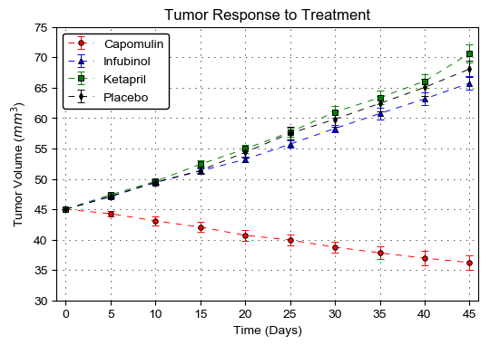
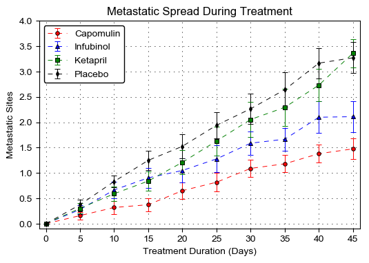
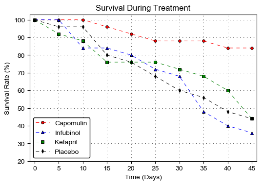
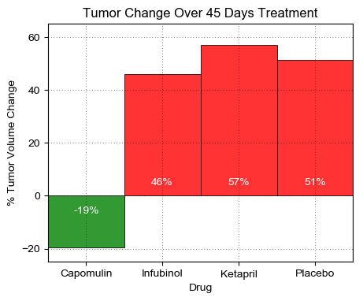

### Pymaceuticals Analysis
* **Observed trend 1:** Of the four treatments of interest (Capomulin, Infubinol, Ketapril, and Placebo), Capomulin is the only treatment under which the tumor volume decreases over 45 days.
* **Observed trend 2:** Over 45 days of treatment, Capomulin has the least increase in the number of metastatic (cancer spreading) sites.
* **Observed trend 3:** Capomulin has the highest survival rate over 45 days of treatment.


```python
import numpy as np
import pandas as pd
import matplotlib.pyplot as plt
from scipy import stats
import matplotlib as mpl
```

### Read data


```python
clinical = pd.read_csv('raw_data/clinicaltrial_data.csv')
mouse = pd.read_csv('raw_data/mouse_drug_data.csv')
```


```python
clinical.head()
```


<div>
<style scoped>
    .dataframe tbody tr th:only-of-type {
        vertical-align: middle;
    }

    .dataframe tbody tr th {
        vertical-align: top;
    }

    .dataframe thead th {
        text-align: right;
    }
</style>
<table border="1" class="dataframe">
  <thead>
    <tr style="text-align: right;">
      <th></th>
      <th>Mouse ID</th>
      <th>Timepoint</th>
      <th>Tumor Volume (mm3)</th>
      <th>Metastatic Sites</th>
    </tr>
  </thead>
  <tbody>
    <tr>
      <th>0</th>
      <td>b128</td>
      <td>0</td>
      <td>45.0</td>
      <td>0</td>
    </tr>
    <tr>
      <th>1</th>
      <td>f932</td>
      <td>0</td>
      <td>45.0</td>
      <td>0</td>
    </tr>
    <tr>
      <th>2</th>
      <td>g107</td>
      <td>0</td>
      <td>45.0</td>
      <td>0</td>
    </tr>
    <tr>
      <th>3</th>
      <td>a457</td>
      <td>0</td>
      <td>45.0</td>
      <td>0</td>
    </tr>
    <tr>
      <th>4</th>
      <td>c819</td>
      <td>0</td>
      <td>45.0</td>
      <td>0</td>
    </tr>
  </tbody>
</table>
</div>


```python
mouse.head()
```


<div>
<style scoped>
    .dataframe tbody tr th:only-of-type {
        vertical-align: middle;
    }

    .dataframe tbody tr th {
        vertical-align: top;
    }

    .dataframe thead th {
        text-align: right;
    }
</style>
<table border="1" class="dataframe">
  <thead>
    <tr style="text-align: right;">
      <th></th>
      <th>Mouse ID</th>
      <th>Drug</th>
    </tr>
  </thead>
  <tbody>
    <tr>
      <th>0</th>
      <td>f234</td>
      <td>Stelasyn</td>
    </tr>
    <tr>
      <th>1</th>
      <td>x402</td>
      <td>Stelasyn</td>
    </tr>
    <tr>
      <th>2</th>
      <td>a492</td>
      <td>Stelasyn</td>
    </tr>
    <tr>
      <th>3</th>
      <td>w540</td>
      <td>Stelasyn</td>
    </tr>
    <tr>
      <th>4</th>
      <td>v764</td>
      <td>Stelasyn</td>
    </tr>
  </tbody>
</table>
</div>


Note that Mouse ID g989 corresponds to 2 drugs, such that both the clinical table and the mouse table have 249 unique mouse ID's. However, the [README](../README.md) description says there are 250 mice in the study, which suggests that some of the g989 entries should have been written under a different mouse ID. The test results of g989 is messed up because there is no definitive evidence which drug g989 results should be related to. Therefore, g989 entries were removed from the dataset to avoid ambiguity.


```python
clinical = clinical.drop(clinical.loc[clinical['Mouse ID']=='g989'].index)
mouse = mouse.drop(mouse.loc[mouse['Mouse ID']=='g989'].index)
data = pd.merge(clinical, mouse, on='Mouse ID', how='inner')
data.head()
```


<div>
<style scoped>
    .dataframe tbody tr th:only-of-type {
        vertical-align: middle;
    }

    .dataframe tbody tr th {
        vertical-align: top;
    }

    .dataframe thead th {
        text-align: right;
    }
</style>
<table border="1" class="dataframe">
  <thead>
    <tr style="text-align: right;">
      <th></th>
      <th>Mouse ID</th>
      <th>Timepoint</th>
      <th>Tumor Volume (mm3)</th>
      <th>Metastatic Sites</th>
      <th>Drug</th>
    </tr>
  </thead>
  <tbody>
    <tr>
      <th>0</th>
      <td>b128</td>
      <td>0</td>
      <td>45.000000</td>
      <td>0</td>
      <td>Capomulin</td>
    </tr>
    <tr>
      <th>1</th>
      <td>b128</td>
      <td>5</td>
      <td>45.651331</td>
      <td>0</td>
      <td>Capomulin</td>
    </tr>
    <tr>
      <th>2</th>
      <td>b128</td>
      <td>10</td>
      <td>43.270852</td>
      <td>0</td>
      <td>Capomulin</td>
    </tr>
    <tr>
      <th>3</th>
      <td>b128</td>
      <td>15</td>
      <td>43.784893</td>
      <td>0</td>
      <td>Capomulin</td>
    </tr>
    <tr>
      <th>4</th>
      <td>b128</td>
      <td>20</td>
      <td>42.731552</td>
      <td>0</td>
      <td>Capomulin</td>
    </tr>
  </tbody>
</table>
</div>


### Tumor Response to Treatment


```python
grouper = data.groupby(['Drug', 'Timepoint'])
tumor = pd.DataFrame()
tumor['Tumor Volume (mm3)'] = grouper['Tumor Volume (mm3)'].mean()
tumor['Standard Error'] = grouper['Tumor Volume (mm3)'].sem()
tumor.head()
```


<div>
<style scoped>
    .dataframe tbody tr th:only-of-type {
        vertical-align: middle;
    }

    .dataframe tbody tr th {
        vertical-align: top;
    }

    .dataframe thead th {
        text-align: right;
    }
</style>
<table border="1" class="dataframe">
  <thead>
    <tr style="text-align: right;">
      <th></th>
      <th></th>
      <th>Tumor Volume (mm3)</th>
      <th>Standard Error</th>
    </tr>
    <tr>
      <th>Drug</th>
      <th>Timepoint</th>
      <th></th>
      <th></th>
    </tr>
  </thead>
  <tbody>
    <tr>
      <th rowspan="5" valign="top">Capomulin</th>
      <th>0</th>
      <td>45.000000</td>
      <td>0.000000</td>
    </tr>
    <tr>
      <th>5</th>
      <td>44.266086</td>
      <td>0.448593</td>
    </tr>
    <tr>
      <th>10</th>
      <td>43.084291</td>
      <td>0.702684</td>
    </tr>
    <tr>
      <th>15</th>
      <td>42.064317</td>
      <td>0.838617</td>
    </tr>
    <tr>
      <th>20</th>
      <td>40.716325</td>
      <td>0.909731</td>
    </tr>
  </tbody>
</table>
</div>


```python
tumor_mean = tumor['Tumor Volume (mm3)'].unstack(level=0)
tumor_se = tumor['Standard Error'].unstack(level=0)
tumor_mean.head()
```


<div>
<style scoped>
    .dataframe tbody tr th:only-of-type {
        vertical-align: middle;
    }

    .dataframe tbody tr th {
        vertical-align: top;
    }

    .dataframe thead th {
        text-align: right;
    }
</style>
<table border="1" class="dataframe">
  <thead>
    <tr style="text-align: right;">
      <th>Drug</th>
      <th>Capomulin</th>
      <th>Ceftamin</th>
      <th>Infubinol</th>
      <th>Ketapril</th>
      <th>Naftisol</th>
      <th>Placebo</th>
      <th>Propriva</th>
      <th>Ramicane</th>
      <th>Stelasyn</th>
      <th>Zoniferol</th>
    </tr>
    <tr>
      <th>Timepoint</th>
      <th></th>
      <th></th>
      <th></th>
      <th></th>
      <th></th>
      <th></th>
      <th></th>
      <th></th>
      <th></th>
      <th></th>
    </tr>
  </thead>
  <tbody>
    <tr>
      <th>0</th>
      <td>45.000000</td>
      <td>45.000000</td>
      <td>45.000000</td>
      <td>45.000000</td>
      <td>45.000000</td>
      <td>45.000000</td>
      <td>45.000000</td>
      <td>45.000000</td>
      <td>45.000000</td>
      <td>45.000000</td>
    </tr>
    <tr>
      <th>5</th>
      <td>44.266086</td>
      <td>46.503051</td>
      <td>47.062001</td>
      <td>47.389175</td>
      <td>46.796098</td>
      <td>47.125589</td>
      <td>47.168130</td>
      <td>43.944859</td>
      <td>47.470830</td>
      <td>46.851818</td>
    </tr>
    <tr>
      <th>10</th>
      <td>43.084291</td>
      <td>48.285125</td>
      <td>49.403909</td>
      <td>49.582269</td>
      <td>48.694210</td>
      <td>49.423329</td>
      <td>48.938560</td>
      <td>42.531957</td>
      <td>49.335368</td>
      <td>48.689881</td>
    </tr>
    <tr>
      <th>15</th>
      <td>42.064317</td>
      <td>50.094055</td>
      <td>51.296397</td>
      <td>52.399974</td>
      <td>50.933018</td>
      <td>51.359742</td>
      <td>50.891769</td>
      <td>41.495061</td>
      <td>51.448025</td>
      <td>50.779059</td>
    </tr>
    <tr>
      <th>20</th>
      <td>40.716325</td>
      <td>52.157049</td>
      <td>53.197691</td>
      <td>54.920935</td>
      <td>53.644087</td>
      <td>54.364417</td>
      <td>53.127384</td>
      <td>40.238325</td>
      <td>53.970080</td>
      <td>53.170334</td>
    </tr>
  </tbody>
</table>
</div>


```python
mpl.rcParams['figure.dpi']= 100
mpl.rcParams['font.family'] = 'sans-serif'
mpl.rcParams['font.sans-serif'] = ['Arial']
drugs = ['Capomulin', 'Infubinol', 'Ketapril', 'Placebo']
markers = ['o', '^', 's', 'd']
colors = ['r', 'b', 'g', 'k']
x = tumor_mean.index
for i in range(len(drugs)):
    drug = drugs[i]
    plt.errorbar(x, tumor_mean[drug], yerr=tumor_se[drug], linestyle='--', linewidth=0.7, dashes=(7, 7), 
                 color=colors[i], capsize=3, marker=markers[i], markersize=4, markerfacecolor=colors[i], 
                 markeredgecolor='k', markeredgewidth=0.7, capthick=0.7)

plt.xticks(range(0,46,5))    
plt.xlim((-1, 46))
plt.ylim((30, 75))
plt.xlabel('Time (Days)')
plt.ylabel('Tumor Volume ($mm^3$)')
plt.title('Tumor Response to Treatment')
plt.legend(loc='best', framealpha=1, edgecolor='k')
plt.grid(linestyle='--', dashes=(2, 8), linewidth=0.5, color='k')
```





### Metastatic Response to Treatment


```python
grouper = data.groupby(['Drug', 'Timepoint'])
metastatic = pd.DataFrame()
metastatic['Metastatic Sites'] = grouper['Metastatic Sites'].mean()
metastatic['Standard Error'] = grouper['Metastatic Sites'].sem()
metastatic.head()
```


<div>
<style scoped>
    .dataframe tbody tr th:only-of-type {
        vertical-align: middle;
    }

    .dataframe tbody tr th {
        vertical-align: top;
    }

    .dataframe thead th {
        text-align: right;
    }
</style>
<table border="1" class="dataframe">
  <thead>
    <tr style="text-align: right;">
      <th></th>
      <th></th>
      <th>Metastatic Sites</th>
      <th>Standard Error</th>
    </tr>
    <tr>
      <th>Drug</th>
      <th>Timepoint</th>
      <th></th>
      <th></th>
    </tr>
  </thead>
  <tbody>
    <tr>
      <th rowspan="5" valign="top">Capomulin</th>
      <th>0</th>
      <td>0.000000</td>
      <td>0.000000</td>
    </tr>
    <tr>
      <th>5</th>
      <td>0.160000</td>
      <td>0.074833</td>
    </tr>
    <tr>
      <th>10</th>
      <td>0.320000</td>
      <td>0.125433</td>
    </tr>
    <tr>
      <th>15</th>
      <td>0.375000</td>
      <td>0.132048</td>
    </tr>
    <tr>
      <th>20</th>
      <td>0.652174</td>
      <td>0.161621</td>
    </tr>
  </tbody>
</table>
</div>


```python
metastatic_mean = metastatic['Metastatic Sites'].unstack(level=0)
metastatic_se = metastatic['Standard Error'].unstack(level=0)
metastatic_mean.head()
```


<div>
<style scoped>
    .dataframe tbody tr th:only-of-type {
        vertical-align: middle;
    }

    .dataframe tbody tr th {
        vertical-align: top;
    }

    .dataframe thead th {
        text-align: right;
    }
</style>
<table border="1" class="dataframe">
  <thead>
    <tr style="text-align: right;">
      <th>Drug</th>
      <th>Capomulin</th>
      <th>Ceftamin</th>
      <th>Infubinol</th>
      <th>Ketapril</th>
      <th>Naftisol</th>
      <th>Placebo</th>
      <th>Propriva</th>
      <th>Ramicane</th>
      <th>Stelasyn</th>
      <th>Zoniferol</th>
    </tr>
    <tr>
      <th>Timepoint</th>
      <th></th>
      <th></th>
      <th></th>
      <th></th>
      <th></th>
      <th></th>
      <th></th>
      <th></th>
      <th></th>
      <th></th>
    </tr>
  </thead>
  <tbody>
    <tr>
      <th>0</th>
      <td>0.000000</td>
      <td>0.000000</td>
      <td>0.000000</td>
      <td>0.000000</td>
      <td>0.000000</td>
      <td>0.000000</td>
      <td>0.000000</td>
      <td>0.000000</td>
      <td>0.000000</td>
      <td>0.000000</td>
    </tr>
    <tr>
      <th>5</th>
      <td>0.160000</td>
      <td>0.380952</td>
      <td>0.280000</td>
      <td>0.304348</td>
      <td>0.260870</td>
      <td>0.375000</td>
      <td>0.347826</td>
      <td>0.120000</td>
      <td>0.260870</td>
      <td>0.166667</td>
    </tr>
    <tr>
      <th>10</th>
      <td>0.320000</td>
      <td>0.600000</td>
      <td>0.666667</td>
      <td>0.590909</td>
      <td>0.523810</td>
      <td>0.833333</td>
      <td>0.619048</td>
      <td>0.250000</td>
      <td>0.523810</td>
      <td>0.500000</td>
    </tr>
    <tr>
      <th>15</th>
      <td>0.375000</td>
      <td>0.789474</td>
      <td>0.904762</td>
      <td>0.842105</td>
      <td>0.857143</td>
      <td>1.250000</td>
      <td>0.800000</td>
      <td>0.333333</td>
      <td>0.809524</td>
      <td>0.809524</td>
    </tr>
    <tr>
      <th>20</th>
      <td>0.652174</td>
      <td>1.111111</td>
      <td>1.050000</td>
      <td>1.210526</td>
      <td>1.150000</td>
      <td>1.526316</td>
      <td>1.000000</td>
      <td>0.347826</td>
      <td>0.947368</td>
      <td>1.294118</td>
    </tr>
  </tbody>
</table>
</div>


```python
drugs = ['Capomulin', 'Infubinol', 'Ketapril', 'Placebo']
markers = ['o', '^', 's', 'd']
colors = ['r', 'b', 'g', 'k']
x = metastatic_mean.index
for i in range(len(drugs)):
    drug = drugs[i]
    plt.errorbar(x, metastatic_mean[drug], yerr=metastatic_se[drug], linestyle='--', linewidth=0.7, 
                 dashes=(7, 7), color=colors[i], capsize=3, marker=markers[i], markersize=4, 
                 markerfacecolor=colors[i], markeredgecolor='k', markeredgewidth=0.7, capthick=0.7)

plt.xticks(range(0,46,5))    
plt.xlim((-1, 46))
plt.ylim((-0.1, 4))
plt.xlabel('Treatment Duration (Days)')
plt.ylabel('Metastatic Sites')
plt.title('Metastatic Spread During Treatment')
plt.legend(loc='best', framealpha=1, edgecolor='k')
plt.grid(linestyle='--', dashes=(2, 8), linewidth=0.5, color='k')
```





### Survival Rates


```python
grouper = data.groupby(['Drug', 'Timepoint'])
survival = pd.DataFrame()
survival['Mouse Count'] = grouper['Mouse ID'].count()
survival.head()
```


<div>
<style scoped>
    .dataframe tbody tr th:only-of-type {
        vertical-align: middle;
    }

    .dataframe tbody tr th {
        vertical-align: top;
    }

    .dataframe thead th {
        text-align: right;
    }
</style>
<table border="1" class="dataframe">
  <thead>
    <tr style="text-align: right;">
      <th></th>
      <th></th>
      <th>Mouse Count</th>
    </tr>
    <tr>
      <th>Drug</th>
      <th>Timepoint</th>
      <th></th>
    </tr>
  </thead>
  <tbody>
    <tr>
      <th rowspan="5" valign="top">Capomulin</th>
      <th>0</th>
      <td>25</td>
    </tr>
    <tr>
      <th>5</th>
      <td>25</td>
    </tr>
    <tr>
      <th>10</th>
      <td>25</td>
    </tr>
    <tr>
      <th>15</th>
      <td>24</td>
    </tr>
    <tr>
      <th>20</th>
      <td>23</td>
    </tr>
  </tbody>
</table>
</div>


```python
survival_count = survival['Mouse Count'].unstack(level=0)
survival_count.head()
```


<div>
<style scoped>
    .dataframe tbody tr th:only-of-type {
        vertical-align: middle;
    }

    .dataframe tbody tr th {
        vertical-align: top;
    }

    .dataframe thead th {
        text-align: right;
    }
</style>
<table border="1" class="dataframe">
  <thead>
    <tr style="text-align: right;">
      <th>Drug</th>
      <th>Capomulin</th>
      <th>Ceftamin</th>
      <th>Infubinol</th>
      <th>Ketapril</th>
      <th>Naftisol</th>
      <th>Placebo</th>
      <th>Propriva</th>
      <th>Ramicane</th>
      <th>Stelasyn</th>
      <th>Zoniferol</th>
    </tr>
    <tr>
      <th>Timepoint</th>
      <th></th>
      <th></th>
      <th></th>
      <th></th>
      <th></th>
      <th></th>
      <th></th>
      <th></th>
      <th></th>
      <th></th>
    </tr>
  </thead>
  <tbody>
    <tr>
      <th>0</th>
      <td>25</td>
      <td>25</td>
      <td>25</td>
      <td>25</td>
      <td>25</td>
      <td>25</td>
      <td>24</td>
      <td>25</td>
      <td>24</td>
      <td>25</td>
    </tr>
    <tr>
      <th>5</th>
      <td>25</td>
      <td>21</td>
      <td>25</td>
      <td>23</td>
      <td>23</td>
      <td>24</td>
      <td>23</td>
      <td>25</td>
      <td>23</td>
      <td>24</td>
    </tr>
    <tr>
      <th>10</th>
      <td>25</td>
      <td>20</td>
      <td>21</td>
      <td>22</td>
      <td>21</td>
      <td>24</td>
      <td>21</td>
      <td>24</td>
      <td>21</td>
      <td>22</td>
    </tr>
    <tr>
      <th>15</th>
      <td>24</td>
      <td>19</td>
      <td>21</td>
      <td>19</td>
      <td>21</td>
      <td>20</td>
      <td>15</td>
      <td>24</td>
      <td>21</td>
      <td>21</td>
    </tr>
    <tr>
      <th>20</th>
      <td>23</td>
      <td>18</td>
      <td>20</td>
      <td>19</td>
      <td>20</td>
      <td>19</td>
      <td>15</td>
      <td>23</td>
      <td>19</td>
      <td>17</td>
    </tr>
  </tbody>
</table>
</div>


```python
drugs = ['Capomulin', 'Infubinol', 'Ketapril', 'Placebo']
markers = ['o', '^', 's', 'd']
colors = ['r', 'b', 'g', 'k']
x = survival_count.index
for i in range(len(drugs)):
    drug = drugs[i]
    survival_rate = survival_count[drug] / survival_count.loc[0, drug] * 100
    plt.errorbar(x, survival_rate, linestyle='--', linewidth=0.7, 
                 dashes=(7, 7), color=colors[i], marker=markers[i], markersize=4, 
                 markerfacecolor=colors[i], markeredgecolor='k', markeredgewidth=0.7)

plt.xticks(range(0,46,5))    
plt.xlim((-1, 46))
plt.ylim((20, 103))
plt.xlabel('Time (Days)')
plt.ylabel('Survival Rate (%)')
plt.title('Survival During Treatment')
plt.legend(loc='best', framealpha=1, edgecolor='k')
plt.grid(linestyle='--', dashes=(2, 8), linewidth=0.5, color='k')
```





### Summary Bar Graph
* Calculate the total % tumor volume change for each drug across the full 45 days


```python
grouper = data.groupby(['Drug', 'Timepoint'])
tumor_change = pd.DataFrame()
tumor_change['Tumor Volume'] = grouper['Tumor Volume (mm3)'].mean()
tumor_change = tumor_change.unstack(level=-1)
tumor_change.columns = tumor_change.columns.droplevel(level=0) # flatten multiindex column
tumor_change['% Tumor Volume Change'] = (tumor_change[45] - tumor_change[0]) / tumor_change[0] * 100
tumor_change = tumor_change[['% Tumor Volume Change']]
tumor_change.head()
```


<div>
<style scoped>
    .dataframe tbody tr th:only-of-type {
        vertical-align: middle;
    }

    .dataframe tbody tr th {
        vertical-align: top;
    }

    .dataframe thead th {
        text-align: right;
    }
</style>
<table border="1" class="dataframe">
  <thead>
    <tr style="text-align: right;">
      <th>Timepoint</th>
      <th>% Tumor Volume Change</th>
    </tr>
    <tr>
      <th>Drug</th>
      <th></th>
    </tr>
  </thead>
  <tbody>
    <tr>
      <th>Capomulin</th>
      <td>-19.475303</td>
    </tr>
    <tr>
      <th>Ceftamin</th>
      <td>42.516492</td>
    </tr>
    <tr>
      <th>Infubinol</th>
      <td>46.123472</td>
    </tr>
    <tr>
      <th>Ketapril</th>
      <td>57.028795</td>
    </tr>
    <tr>
      <th>Naftisol</th>
      <td>53.923347</td>
    </tr>
  </tbody>
</table>
</div>


```python
drugs = ['Capomulin', 'Infubinol', 'Ketapril', 'Placebo']
colors = ['r' if (tumor_change.loc[drug]>0).values[0] else 'g' for drug in drugs]
ax = tumor_change.loc[drugs].plot(kind='bar', color=[tuple(colors)], rot=0, legend=False, alpha=0.8,
                            edgecolor = 'k', linewidth=0.7, width=1, figsize=(5,4))

plt.xlim((-0.5, 3.5))
plt.ylim((-25, 65))
plt.yticks(range(-20,70,20))
plt.ylabel('% Tumor Volume Change')
plt.title('Tumor Change Over 45 Days Treatment')
plt.grid(linestyle='--', dashes=(1, 4), linewidth=0.5, color='k')

# Add text labels
posx = range(len(drugs))
posy = [3 if (tumor_change.loc[drug]>0).values[0] else -4 for drug in drugs]
va = ['bottom' if (tumor_change.loc[drug]>0).values[0] else 'top' for drug in drugs]
labels = tumor_change.loc[drugs].values
for i in range(len(drugs)):
    ax.text(posx[i], posy[i], '%1.0d%%' % int(labels[i]), ha='center', va=va[i], color='w')

```




