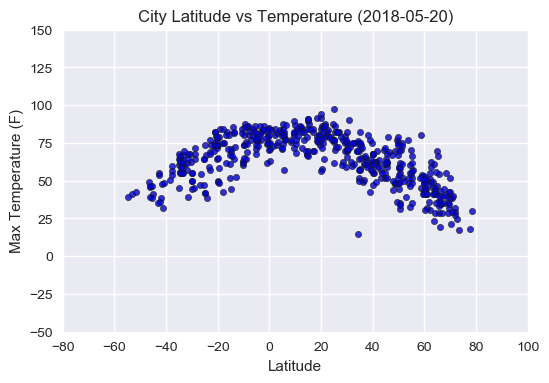
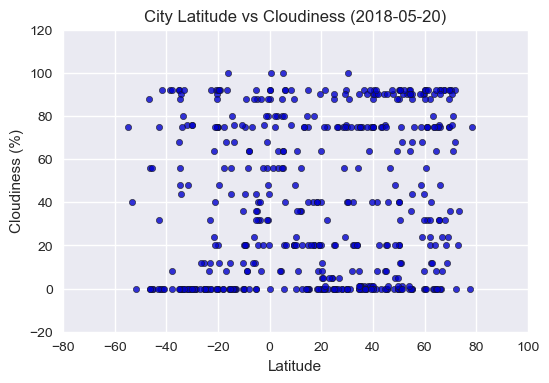

### WeatherPy Analysis
- Observed trend 1: Temperature increases with proximity to equator.
- Observed trent 2: Humidity is consistently high near the equator; northern hemisphere is generally more humid than southern hemisphere.
- Observed trend 3: Cloudiness and wind speed do not exhibit clear trend with latitude.


```python
import pandas as pd
import numpy as np
import matplotlib.pyplot as plt
import matplotlib as mpl
import seaborn as sns
from citipy import citipy
import requests
api_key = ""
```

### Generate a list of cities


```python
# Choose lat and lon for query
lat_range = range(-90, 90, 5)
lon_range = range(-180, 180, 10)
lat_lon_list = []
for lat in lat_range:
    for lon in lon_range:
        lat_lon_list.append((lat, lon))
```


```python
# Query city name and country code based on lat and lon
city_list = []
for lat, lon in lat_lon_list:
    city = citipy.nearest_city(lat, lon)
    name = city.city_name
    country = city.country_code
    city_list.append(name + "," + country)

# find unique cities
city_unique = list(set(city_list))
print(f"{len(city_unique)} unique cities selected.")
```

    589 unique cities selected.


### Perform API calls


```python
# Initiate dataframe to store data
df = pd.DataFrame()
df['City Name'] = ''
df['Country Code'] = ''
df['Latitude'] = ''
df['Longitude'] = ''
df['Max Temperature (F)'] = ''
df['Humidity (%)'] = ''
df['Cloudiness (%)'] = ''
df['Wind Speed (mph)'] = ''
df['UTC Datetime'] = ''

# Send API requests to retrieve current weather data
base_url = "http://api.openweathermap.org/data/2.5/weather"
params = {
    'appid': api_key,
    'units': 'imperial'
}
count = 0

for city in city_unique:
    params['q'] = city
    response = requests.get(base_url, params = params)
    if response.status_code == 200:
        data = response.json()
        df.loc[count, 'City Name'] = city.split(',')[0].title()
        df.loc[count, 'Country Code'] = city.split(',')[1].upper()
        df.loc[count, 'Latitude'] = data['coord']['lat']
        df.loc[count, 'Longitude'] = data['coord']['lon']
        df.loc[count, 'Max Temperature (F)'] = data['main']['temp_max']
        df.loc[count, 'Humidity (%)'] = data['main']['humidity']
        df.loc[count, 'Cloudiness (%)'] = data['clouds']['all']
        df.loc[count, 'Wind Speed (mph)'] = data['wind']['speed']
        df.loc[count, 'UTC Datetime'] = data['dt']
        
        print(f"Processing Record {count}, Latitude {data['coord']['lat']}: {city.split(',')[0].title()}")
        print(response.url.replace(api_key,'*'*len(api_key)))
        count += 1

print("-"*27)
print("Data Retrieval Complete")
print("-"*27)
```

    Processing Record 0, Latitude -34.53: Bredasdorp
    http://api.openweathermap.org/data/2.5/weather?appid=********************************&units=imperial&q=bredasdorp%2Cza
    Processing Record 1, Latitude 55.1: Atagay
    http://api.openweathermap.org/data/2.5/weather?appid=********************************&units=imperial&q=atagay%2Cru
    Processing Record 2, Latitude -25.1: Lydenburg
    http://api.openweathermap.org/data/2.5/weather?appid=********************************&units=imperial&q=lydenburg%2Cza
    Processing Record 3, Latitude -0.72: Port-Gentil
    http://api.openweathermap.org/data/2.5/weather?appid=********************************&units=imperial&q=port-gentil%2Cga
    Processing Record 4, Latitude 62.1: Raduzhnyy
    http://api.openweathermap.org/data/2.5/weather?appid=********************************&units=imperial&q=raduzhnyy%2Cru
    Processing Record 5, Latitude 33.77: Fukuma
    http://api.openweathermap.org/data/2.5/weather?appid=********************************&units=imperial&q=fukuma%2Cjp
    Processing Record 6, Latitude -10.07: Huarmey
    http://api.openweathermap.org/data/2.5/weather?appid=********************************&units=imperial&q=huarmey%2Cpe
    Processing Record 7, Latitude -29.95: Coquimbo
    http://api.openweathermap.org/data/2.5/weather?appid=********************************&units=imperial&q=coquimbo%2Ccl
    Processing Record 8, Latitude 12.17: Osmena
    http://api.openweathermap.org/data/2.5/weather?appid=********************************&units=imperial&q=osmena%2Cph
    Processing Record 9, Latitude 34.95: Santa Maria
    http://api.openweathermap.org/data/2.5/weather?appid=********************************&units=imperial&q=santa+maria%2Cus
    Processing Record 10, Latitude 49.91: Maple Creek
    http://api.openweathermap.org/data/2.5/weather?appid=********************************&units=imperial&q=maple+creek%2Cca
    Processing Record 11, Latitude 65.73: Zyryanka
    http://api.openweathermap.org/data/2.5/weather?appid=********************************&units=imperial&q=zyryanka%2Cru
    Processing Record 12, Latitude -28.65: Byron Bay
    http://api.openweathermap.org/data/2.5/weather?appid=********************************&units=imperial&q=byron+bay%2Cau
    Processing Record 13, Latitude 10.31: Bauchi
    http://api.openweathermap.org/data/2.5/weather?appid=********************************&units=imperial&q=bauchi%2Cng
    Processing Record 14, Latitude 25.02: Sherpur
    http://api.openweathermap.org/data/2.5/weather?appid=********************************&units=imperial&q=sherpur%2Cbd
    Processing Record 15, Latitude 44.51: Fort-Shevchenko
    http://api.openweathermap.org/data/2.5/weather?appid=********************************&units=imperial&q=fort-shevchenko%2Ckz
    Processing Record 16, Latitude 19.77: Sosua
    http://api.openweathermap.org/data/2.5/weather?appid=********************************&units=imperial&q=sosua%2Cdo
    Processing Record 17, Latitude 24.83: Galeana
    http://api.openweathermap.org/data/2.5/weather?appid=********************************&units=imperial&q=galeana%2Cmx
    Processing Record 18, Latitude 36.62: Pacific Grove
    http://api.openweathermap.org/data/2.5/weather?appid=********************************&units=imperial&q=pacific+grove%2Cus
    Processing Record 19, Latitude -54.81: Ushuaia
    http://api.openweathermap.org/data/2.5/weather?appid=********************************&units=imperial&q=ushuaia%2Car
    Processing Record 20, Latitude 23.99: Constitucion
    http://api.openweathermap.org/data/2.5/weather?appid=********************************&units=imperial&q=constitucion%2Cmx
    Processing Record 21, Latitude 22.57: Sur
    http://api.openweathermap.org/data/2.5/weather?appid=********************************&units=imperial&q=sur%2Com
    Processing Record 22, Latitude 25.02: Umm Lajj
    http://api.openweathermap.org/data/2.5/weather?appid=********************************&units=imperial&q=umm+lajj%2Csa
    Processing Record 23, Latitude -46.13: Tuatapere
    http://api.openweathermap.org/data/2.5/weather?appid=********************************&units=imperial&q=tuatapere%2Cnz
    Processing Record 24, Latitude 36.62: Xining
    http://api.openweathermap.org/data/2.5/weather?appid=********************************&units=imperial&q=xining%2Ccn
    Processing Record 25, Latitude 3.07: Butaritari
    http://api.openweathermap.org/data/2.5/weather?appid=********************************&units=imperial&q=butaritari%2Cki
    Processing Record 26, Latitude 38.05: Lexington
    http://api.openweathermap.org/data/2.5/weather?appid=********************************&units=imperial&q=lexington%2Cus
    Processing Record 27, Latitude 35.41: Elk City
    http://api.openweathermap.org/data/2.5/weather?appid=********************************&units=imperial&q=elk+city%2Cus
    Processing Record 28, Latitude 5.95: Matara
    http://api.openweathermap.org/data/2.5/weather?appid=********************************&units=imperial&q=matara%2Clk
    Processing Record 29, Latitude -22.95: Walvis Bay
    http://api.openweathermap.org/data/2.5/weather?appid=********************************&units=imperial&q=walvis+bay%2Cna
    Processing Record 30, Latitude 70.86: Berlevag
    http://api.openweathermap.org/data/2.5/weather?appid=********************************&units=imperial&q=berlevag%2Cno
    Processing Record 31, Latitude 59.08: Palana
    http://api.openweathermap.org/data/2.5/weather?appid=********************************&units=imperial&q=palana%2Cru
    Processing Record 32, Latitude 20.17: Hecelchakan
    http://api.openweathermap.org/data/2.5/weather?appid=********************************&units=imperial&q=hecelchakan%2Cmx
    Processing Record 33, Latitude 0.2: Kilembe
    http://api.openweathermap.org/data/2.5/weather?appid=********************************&units=imperial&q=kilembe%2Cug
    Processing Record 34, Latitude 29.14: Awjilah
    http://api.openweathermap.org/data/2.5/weather?appid=********************************&units=imperial&q=awjilah%2Cly
    Processing Record 35, Latitude 60.91: Narsaq
    http://api.openweathermap.org/data/2.5/weather?appid=********************************&units=imperial&q=narsaq%2Cgl
    Processing Record 36, Latitude -33.92: Port Elizabeth
    http://api.openweathermap.org/data/2.5/weather?appid=********************************&units=imperial&q=port+elizabeth%2Cza
    Processing Record 37, Latitude -1.02: San Cristobal
    http://api.openweathermap.org/data/2.5/weather?appid=********************************&units=imperial&q=san+cristobal%2Cec
    Processing Record 38, Latitude 14.9: Sao Filipe
    http://api.openweathermap.org/data/2.5/weather?appid=********************************&units=imperial&q=sao+filipe%2Ccv
    Processing Record 39, Latitude 50.72: Solnechnyy
    http://api.openweathermap.org/data/2.5/weather?appid=********************************&units=imperial&q=solnechnyy%2Cru
    Processing Record 40, Latitude -35.12: Murray Bridge
    http://api.openweathermap.org/data/2.5/weather?appid=********************************&units=imperial&q=murray+bridge%2Cau
    Processing Record 41, Latitude 15.02: San Narciso
    http://api.openweathermap.org/data/2.5/weather?appid=********************************&units=imperial&q=san+narciso%2Cph
    Processing Record 42, Latitude 43.21: Carballo
    http://api.openweathermap.org/data/2.5/weather?appid=********************************&units=imperial&q=carballo%2Ces
    Processing Record 43, Latitude -5.13: Boa Viagem
    http://api.openweathermap.org/data/2.5/weather?appid=********************************&units=imperial&q=boa+viagem%2Cbr
    Processing Record 44, Latitude -0.74: Puerto Ayora
    http://api.openweathermap.org/data/2.5/weather?appid=********************************&units=imperial&q=puerto+ayora%2Cec
    Processing Record 45, Latitude -23.12: Rikitea
    http://api.openweathermap.org/data/2.5/weather?appid=********************************&units=imperial&q=rikitea%2Cpf
    Processing Record 46, Latitude -33.64: Busselton
    http://api.openweathermap.org/data/2.5/weather?appid=********************************&units=imperial&q=busselton%2Cau
    Processing Record 47, Latitude 5.35: Hobyo
    http://api.openweathermap.org/data/2.5/weather?appid=********************************&units=imperial&q=hobyo%2Cso
    Processing Record 48, Latitude 5.56: Accra
    http://api.openweathermap.org/data/2.5/weather?appid=********************************&units=imperial&q=accra%2Cgh
    Processing Record 49, Latitude 50.68: Severo-Kurilsk
    http://api.openweathermap.org/data/2.5/weather?appid=********************************&units=imperial&q=severo-kurilsk%2Cru
    Processing Record 50, Latitude 44.77: Chaihe
    http://api.openweathermap.org/data/2.5/weather?appid=********************************&units=imperial&q=chaihe%2Ccn
    Processing Record 51, Latitude -9.67: Maceio
    http://api.openweathermap.org/data/2.5/weather?appid=********************************&units=imperial&q=maceio%2Cbr
    Processing Record 52, Latitude 4.38: Harper
    http://api.openweathermap.org/data/2.5/weather?appid=********************************&units=imperial&q=harper%2Clr
    Processing Record 53, Latitude -33.59: Port Alfred
    http://api.openweathermap.org/data/2.5/weather?appid=********************************&units=imperial&q=port+alfred%2Cza
    Processing Record 54, Latitude -19.93: Mayor Pablo Lagerenza
    http://api.openweathermap.org/data/2.5/weather?appid=********************************&units=imperial&q=mayor+pablo+lagerenza%2Cpy
    Processing Record 55, Latitude 17.01: Salalah
    http://api.openweathermap.org/data/2.5/weather?appid=********************************&units=imperial&q=salalah%2Com
    Processing Record 56, Latitude -6.12: Kiunga
    http://api.openweathermap.org/data/2.5/weather?appid=********************************&units=imperial&q=kiunga%2Cpg
    Processing Record 57, Latitude 8.4: La Palma
    http://api.openweathermap.org/data/2.5/weather?appid=********************************&units=imperial&q=la+palma%2Cpa
    Processing Record 58, Latitude 3.38: Lethem
    http://api.openweathermap.org/data/2.5/weather?appid=********************************&units=imperial&q=lethem%2Cgy
    Processing Record 59, Latitude 27.04: Rosarito
    http://api.openweathermap.org/data/2.5/weather?appid=********************************&units=imperial&q=rosarito%2Cmx
    Processing Record 60, Latitude 50.1: Vysokogornyy
    http://api.openweathermap.org/data/2.5/weather?appid=********************************&units=imperial&q=vysokogornyy%2Cru
    Processing Record 61, Latitude 40.26: Bayburt
    http://api.openweathermap.org/data/2.5/weather?appid=********************************&units=imperial&q=bayburt%2Ctr
    Processing Record 62, Latitude -34.72: Port Lincoln
    http://api.openweathermap.org/data/2.5/weather?appid=********************************&units=imperial&q=port+lincoln%2Cau
    Processing Record 63, Latitude 41.49: Newport
    http://api.openweathermap.org/data/2.5/weather?appid=********************************&units=imperial&q=newport%2Cus
    Processing Record 64, Latitude 51.19: Cochrane
    http://api.openweathermap.org/data/2.5/weather?appid=********************************&units=imperial&q=cochrane%2Cca
    Processing Record 65, Latitude 19.71: Hilo
    http://api.openweathermap.org/data/2.5/weather?appid=********************************&units=imperial&q=hilo%2Cus
    Processing Record 66, Latitude 9.65: Tokonou
    http://api.openweathermap.org/data/2.5/weather?appid=********************************&units=imperial&q=tokonou%2Cgn
    Processing Record 67, Latitude 59.06: Kargasok
    http://api.openweathermap.org/data/2.5/weather?appid=********************************&units=imperial&q=kargasok%2Cru
    Processing Record 68, Latitude 60.79: Bethel
    http://api.openweathermap.org/data/2.5/weather?appid=********************************&units=imperial&q=bethel%2Cus
    Processing Record 69, Latitude 71.97: Saskylakh
    http://api.openweathermap.org/data/2.5/weather?appid=********************************&units=imperial&q=saskylakh%2Cru
    Processing Record 70, Latitude 66.32: Egvekinot
    http://api.openweathermap.org/data/2.5/weather?appid=********************************&units=imperial&q=egvekinot%2Cru
    Processing Record 71, Latitude 2.82: Boa Vista
    http://api.openweathermap.org/data/2.5/weather?appid=********************************&units=imperial&q=boa+vista%2Cbr
    Processing Record 72, Latitude 32.3: Hamilton
    http://api.openweathermap.org/data/2.5/weather?appid=********************************&units=imperial&q=hamilton%2Cbm
    Processing Record 73, Latitude -45.13: Ranfurly
    http://api.openweathermap.org/data/2.5/weather?appid=********************************&units=imperial&q=ranfurly%2Cnz
    Processing Record 74, Latitude 18.62: Coahuayana
    http://api.openweathermap.org/data/2.5/weather?appid=********************************&units=imperial&q=coahuayana%2Cmx
    Processing Record 75, Latitude 45.41: Sarkand
    http://api.openweathermap.org/data/2.5/weather?appid=********************************&units=imperial&q=sarkand%2Ckz
    Processing Record 76, Latitude -20.21: Quatre Cocos
    http://api.openweathermap.org/data/2.5/weather?appid=********************************&units=imperial&q=quatre+cocos%2Cmu
    Processing Record 77, Latitude 31.86: Nalut
    http://api.openweathermap.org/data/2.5/weather?appid=********************************&units=imperial&q=nalut%2Cly
    Processing Record 78, Latitude 35.02: Winslow
    http://api.openweathermap.org/data/2.5/weather?appid=********************************&units=imperial&q=winslow%2Cus
    Processing Record 79, Latitude -45.58: Coihaique
    http://api.openweathermap.org/data/2.5/weather?appid=********************************&units=imperial&q=coihaique%2Ccl
    Processing Record 80, Latitude 66.83: Yar-Sale
    http://api.openweathermap.org/data/2.5/weather?appid=********************************&units=imperial&q=yar-sale%2Cru
    Processing Record 81, Latitude -42.48: Castro
    http://api.openweathermap.org/data/2.5/weather?appid=********************************&units=imperial&q=castro%2Ccl
    Processing Record 82, Latitude -4.97: Micheweni
    http://api.openweathermap.org/data/2.5/weather?appid=********************************&units=imperial&q=micheweni%2Ctz
    Processing Record 83, Latitude 2.04: Mogadishu
    http://api.openweathermap.org/data/2.5/weather?appid=********************************&units=imperial&q=mogadishu%2Cso
    Processing Record 84, Latitude -20.08: Cardoso
    http://api.openweathermap.org/data/2.5/weather?appid=********************************&units=imperial&q=cardoso%2Cbr
    Processing Record 85, Latitude 59.7: Nikolskoye
    http://api.openweathermap.org/data/2.5/weather?appid=********************************&units=imperial&q=nikolskoye%2Cru
    Processing Record 86, Latitude 41.32: Hazorasp
    http://api.openweathermap.org/data/2.5/weather?appid=********************************&units=imperial&q=hazorasp%2Cuz
    Processing Record 87, Latitude 37.17: Sitka
    http://api.openweathermap.org/data/2.5/weather?appid=********************************&units=imperial&q=sitka%2Cus
    Processing Record 88, Latitude 49.2: Hailar
    http://api.openweathermap.org/data/2.5/weather?appid=********************************&units=imperial&q=hailar%2Ccn
    Processing Record 89, Latitude -35.17: Ahipara
    http://api.openweathermap.org/data/2.5/weather?appid=********************************&units=imperial&q=ahipara%2Cnz
    Processing Record 90, Latitude 34.69: Tafresh
    http://api.openweathermap.org/data/2.5/weather?appid=********************************&units=imperial&q=tafresh%2Cir
    Processing Record 91, Latitude -15.77: Kununurra
    http://api.openweathermap.org/data/2.5/weather?appid=********************************&units=imperial&q=kununurra%2Cau
    Processing Record 92, Latitude -53.16: Punta Arenas
    http://api.openweathermap.org/data/2.5/weather?appid=********************************&units=imperial&q=punta+arenas%2Ccl
    Processing Record 93, Latitude 9.45: Yendi
    http://api.openweathermap.org/data/2.5/weather?appid=********************************&units=imperial&q=yendi%2Cgh
    Processing Record 94, Latitude 16.86: Acapulco
    http://api.openweathermap.org/data/2.5/weather?appid=********************************&units=imperial&q=acapulco%2Cmx
    Processing Record 95, Latitude -30.86: Margate
    http://api.openweathermap.org/data/2.5/weather?appid=********************************&units=imperial&q=margate%2Cza
    Processing Record 96, Latitude -12.88: Luangwa
    http://api.openweathermap.org/data/2.5/weather?appid=********************************&units=imperial&q=luangwa%2Czm
    Processing Record 97, Latitude 50.03: Port-Cartier
    http://api.openweathermap.org/data/2.5/weather?appid=********************************&units=imperial&q=port-cartier%2Cca
    Processing Record 98, Latitude 69.7: Pevek
    http://api.openweathermap.org/data/2.5/weather?appid=********************************&units=imperial&q=pevek%2Cru
    Processing Record 99, Latitude 48.65: Bonavista
    http://api.openweathermap.org/data/2.5/weather?appid=********************************&units=imperial&q=bonavista%2Cca
    Processing Record 100, Latitude 12.18: San Policarpo
    http://api.openweathermap.org/data/2.5/weather?appid=********************************&units=imperial&q=san+policarpo%2Cph
    Processing Record 101, Latitude -13.19: Ambilobe
    http://api.openweathermap.org/data/2.5/weather?appid=********************************&units=imperial&q=ambilobe%2Cmg
    Processing Record 102, Latitude -24.87: Carnarvon
    http://api.openweathermap.org/data/2.5/weather?appid=********************************&units=imperial&q=carnarvon%2Cau
    Processing Record 103, Latitude -15.16: Rubiataba
    http://api.openweathermap.org/data/2.5/weather?appid=********************************&units=imperial&q=rubiataba%2Cbr
    Processing Record 104, Latitude -25.41: Taltal
    http://api.openweathermap.org/data/2.5/weather?appid=********************************&units=imperial&q=taltal%2Ccl
    Processing Record 105, Latitude 13.49: La Libertad
    http://api.openweathermap.org/data/2.5/weather?appid=********************************&units=imperial&q=la+libertad%2Csv
    Processing Record 106, Latitude 58.6: Kodinsk
    http://api.openweathermap.org/data/2.5/weather?appid=********************************&units=imperial&q=kodinsk%2Cru
    Processing Record 107, Latitude 20.07: Mul
    http://api.openweathermap.org/data/2.5/weather?appid=********************************&units=imperial&q=mul%2Cin
    Processing Record 108, Latitude 66.04: Inta
    http://api.openweathermap.org/data/2.5/weather?appid=********************************&units=imperial&q=inta%2Cru
    Processing Record 109, Latitude 65.95: Aykhal
    http://api.openweathermap.org/data/2.5/weather?appid=********************************&units=imperial&q=aykhal%2Cru
    Processing Record 110, Latitude -34: Kruisfontein
    http://api.openweathermap.org/data/2.5/weather?appid=********************************&units=imperial&q=kruisfontein%2Cza
    Processing Record 111, Latitude 64.86: College
    http://api.openweathermap.org/data/2.5/weather?appid=********************************&units=imperial&q=college%2Cus
    Processing Record 112, Latitude 48.41: Thunder Bay
    http://api.openweathermap.org/data/2.5/weather?appid=********************************&units=imperial&q=thunder+bay%2Cca
    Processing Record 113, Latitude -13.71: Pisco
    http://api.openweathermap.org/data/2.5/weather?appid=********************************&units=imperial&q=pisco%2Cpe
    Processing Record 114, Latitude 34.99: Southaven
    http://api.openweathermap.org/data/2.5/weather?appid=********************************&units=imperial&q=southaven%2Cus
    Processing Record 115, Latitude 4.95: Nkongsamba
    http://api.openweathermap.org/data/2.5/weather?appid=********************************&units=imperial&q=nkongsamba%2Ccm
    Processing Record 116, Latitude 25.29: Chabahar
    http://api.openweathermap.org/data/2.5/weather?appid=********************************&units=imperial&q=chabahar%2Cir
    Processing Record 117, Latitude 63.84: Grindavik
    http://api.openweathermap.org/data/2.5/weather?appid=********************************&units=imperial&q=grindavik%2Cis
    Processing Record 118, Latitude -0.9: Palu
    http://api.openweathermap.org/data/2.5/weather?appid=********************************&units=imperial&q=palu%2Cid
    Processing Record 119, Latitude -20.13: Serra
    http://api.openweathermap.org/data/2.5/weather?appid=********************************&units=imperial&q=serra%2Cbr
    Processing Record 120, Latitude 73.51: Dikson
    http://api.openweathermap.org/data/2.5/weather?appid=********************************&units=imperial&q=dikson%2Cru
    Processing Record 121, Latitude 54.99: Guderup
    http://api.openweathermap.org/data/2.5/weather?appid=********************************&units=imperial&q=guderup%2Cdk
    Processing Record 122, Latitude -20.56: Koumac
    http://api.openweathermap.org/data/2.5/weather?appid=********************************&units=imperial&q=koumac%2Cnc
    Processing Record 123, Latitude 54.32: Prince Rupert
    http://api.openweathermap.org/data/2.5/weather?appid=********************************&units=imperial&q=prince+rupert%2Cca
    Processing Record 124, Latitude 62.58: Roald
    http://api.openweathermap.org/data/2.5/weather?appid=********************************&units=imperial&q=roald%2Cno
    Processing Record 125, Latitude 29.7: Tiznit
    http://api.openweathermap.org/data/2.5/weather?appid=********************************&units=imperial&q=tiznit%2Cma
    Processing Record 126, Latitude 49.98: Wieliczka
    http://api.openweathermap.org/data/2.5/weather?appid=********************************&units=imperial&q=wieliczka%2Cpl
    Processing Record 127, Latitude -41.75: Westport
    http://api.openweathermap.org/data/2.5/weather?appid=********************************&units=imperial&q=westport%2Cnz
    Processing Record 128, Latitude 59.94: Volchansk
    http://api.openweathermap.org/data/2.5/weather?appid=********************************&units=imperial&q=volchansk%2Cru
    Processing Record 129, Latitude -15.19: Namibe
    http://api.openweathermap.org/data/2.5/weather?appid=********************************&units=imperial&q=namibe%2Cao
    Processing Record 130, Latitude 30.05: Fuyang
    http://api.openweathermap.org/data/2.5/weather?appid=********************************&units=imperial&q=fuyang%2Ccn
    Processing Record 131, Latitude 39.94: Qinhuangdao
    http://api.openweathermap.org/data/2.5/weather?appid=********************************&units=imperial&q=qinhuangdao%2Ccn
    Processing Record 132, Latitude -14.9: Antalaha
    http://api.openweathermap.org/data/2.5/weather?appid=********************************&units=imperial&q=antalaha%2Cmg
    Processing Record 133, Latitude 49.49: Darhan
    http://api.openweathermap.org/data/2.5/weather?appid=********************************&units=imperial&q=darhan%2Cmn
    Processing Record 134, Latitude -34.41: Rengo
    http://api.openweathermap.org/data/2.5/weather?appid=********************************&units=imperial&q=rengo%2Ccl
    Processing Record 135, Latitude -5.56: Kimbe
    http://api.openweathermap.org/data/2.5/weather?appid=********************************&units=imperial&q=kimbe%2Cpg
    Processing Record 136, Latitude -22.97: Arraial Do Cabo
    http://api.openweathermap.org/data/2.5/weather?appid=********************************&units=imperial&q=arraial+do+cabo%2Cbr
    Processing Record 137, Latitude 28.66: Los Llanos De Aridane
    http://api.openweathermap.org/data/2.5/weather?appid=********************************&units=imperial&q=los+llanos+de+aridane%2Ces
    Processing Record 138, Latitude 14.53: Biltine
    http://api.openweathermap.org/data/2.5/weather?appid=********************************&units=imperial&q=biltine%2Ctd
    Processing Record 139, Latitude 20.25: Progreso
    http://api.openweathermap.org/data/2.5/weather?appid=********************************&units=imperial&q=progreso%2Cmx
    Processing Record 140, Latitude -18.06: Opuwo
    http://api.openweathermap.org/data/2.5/weather?appid=********************************&units=imperial&q=opuwo%2Cna
    Processing Record 141, Latitude -31.97: Broken Hill
    http://api.openweathermap.org/data/2.5/weather?appid=********************************&units=imperial&q=broken+hill%2Cau
    Processing Record 142, Latitude 69.22: Ilulissat
    http://api.openweathermap.org/data/2.5/weather?appid=********************************&units=imperial&q=ilulissat%2Cgl
    Processing Record 143, Latitude -9.43: Honiara
    http://api.openweathermap.org/data/2.5/weather?appid=********************************&units=imperial&q=honiara%2Csb
    Processing Record 144, Latitude 69.44: Tuktoyaktuk
    http://api.openweathermap.org/data/2.5/weather?appid=********************************&units=imperial&q=tuktoyaktuk%2Cca
    Processing Record 145, Latitude 39.95: Kodiak
    http://api.openweathermap.org/data/2.5/weather?appid=********************************&units=imperial&q=kodiak%2Cus
    Processing Record 146, Latitude 67.67: Sorland
    http://api.openweathermap.org/data/2.5/weather?appid=********************************&units=imperial&q=sorland%2Cno
    Processing Record 147, Latitude 60.82: Hay River
    http://api.openweathermap.org/data/2.5/weather?appid=********************************&units=imperial&q=hay+river%2Cca
    Processing Record 148, Latitude -29.98: Tramandai
    http://api.openweathermap.org/data/2.5/weather?appid=********************************&units=imperial&q=tramandai%2Cbr
    Processing Record 149, Latitude 41.28: Nantucket
    http://api.openweathermap.org/data/2.5/weather?appid=********************************&units=imperial&q=nantucket%2Cus
    Processing Record 150, Latitude -0.46: Garissa
    http://api.openweathermap.org/data/2.5/weather?appid=********************************&units=imperial&q=garissa%2Cke
    Processing Record 151, Latitude 40.6: Fortuna
    http://api.openweathermap.org/data/2.5/weather?appid=********************************&units=imperial&q=fortuna%2Cus
    Processing Record 152, Latitude -13.88: Sola
    http://api.openweathermap.org/data/2.5/weather?appid=********************************&units=imperial&q=sola%2Cvu
    Processing Record 153, Latitude 18.48: Marawi
    http://api.openweathermap.org/data/2.5/weather?appid=********************************&units=imperial&q=marawi%2Csd
    Processing Record 154, Latitude 21.43: Mecca
    http://api.openweathermap.org/data/2.5/weather?appid=********************************&units=imperial&q=mecca%2Csa
    Processing Record 155, Latitude 5.56: Banda Aceh
    http://api.openweathermap.org/data/2.5/weather?appid=********************************&units=imperial&q=banda+aceh%2Cid
    Processing Record 156, Latitude -9.08: Chimbote
    http://api.openweathermap.org/data/2.5/weather?appid=********************************&units=imperial&q=chimbote%2Cpe
    Processing Record 157, Latitude 29.85: Bageshwar
    http://api.openweathermap.org/data/2.5/weather?appid=********************************&units=imperial&q=bageshwar%2Cin
    Processing Record 158, Latitude 66.15: Pangnirtung
    http://api.openweathermap.org/data/2.5/weather?appid=********************************&units=imperial&q=pangnirtung%2Cca
    Processing Record 159, Latitude 53.94: Mnogovershinnyy
    http://api.openweathermap.org/data/2.5/weather?appid=********************************&units=imperial&q=mnogovershinnyy%2Cru
    Processing Record 160, Latitude 25.6: Dali
    http://api.openweathermap.org/data/2.5/weather?appid=********************************&units=imperial&q=dali%2Ccn
    Processing Record 161, Latitude -25.24: Yulara
    http://api.openweathermap.org/data/2.5/weather?appid=********************************&units=imperial&q=yulara%2Cau
    Processing Record 162, Latitude 36.37: Kumluca
    http://api.openweathermap.org/data/2.5/weather?appid=********************************&units=imperial&q=kumluca%2Ctr
    Processing Record 163, Latitude 29.29: Ormond Beach
    http://api.openweathermap.org/data/2.5/weather?appid=********************************&units=imperial&q=ormond+beach%2Cus
    Processing Record 164, Latitude 44.91: Libourne
    http://api.openweathermap.org/data/2.5/weather?appid=********************************&units=imperial&q=libourne%2Cfr
    Processing Record 165, Latitude -10.46: Kirakira
    http://api.openweathermap.org/data/2.5/weather?appid=********************************&units=imperial&q=kirakira%2Csb
    Processing Record 166, Latitude 54.91: Bulaevo
    http://api.openweathermap.org/data/2.5/weather?appid=********************************&units=imperial&q=bulaevo%2Ckz
    Processing Record 167, Latitude 21.46: Cockburn Town
    http://api.openweathermap.org/data/2.5/weather?appid=********************************&units=imperial&q=cockburn+town%2Ctc
    Processing Record 168, Latitude -3.44: Mayumba
    http://api.openweathermap.org/data/2.5/weather?appid=********************************&units=imperial&q=mayumba%2Cga
    Processing Record 169, Latitude 14.69: Dakar
    http://api.openweathermap.org/data/2.5/weather?appid=********************************&units=imperial&q=dakar%2Csn
    Processing Record 170, Latitude 44.37: Pierre
    http://api.openweathermap.org/data/2.5/weather?appid=********************************&units=imperial&q=pierre%2Cus
    Processing Record 171, Latitude 11.04: Am Timan
    http://api.openweathermap.org/data/2.5/weather?appid=********************************&units=imperial&q=am+timan%2Ctd
    Processing Record 172, Latitude 72.79: Upernavik
    http://api.openweathermap.org/data/2.5/weather?appid=********************************&units=imperial&q=upernavik%2Cgl
    Processing Record 173, Latitude 34.45: Abu Kamal
    http://api.openweathermap.org/data/2.5/weather?appid=********************************&units=imperial&q=abu+kamal%2Csy
    Processing Record 174, Latitude -4.38: Benjamin Constant
    http://api.openweathermap.org/data/2.5/weather?appid=********************************&units=imperial&q=benjamin+constant%2Cbr
    Processing Record 175, Latitude 71.64: Tiksi
    http://api.openweathermap.org/data/2.5/weather?appid=********************************&units=imperial&q=tiksi%2Cru
    Processing Record 176, Latitude 54.11: Ballina
    http://api.openweathermap.org/data/2.5/weather?appid=********************************&units=imperial&q=ballina%2Cie
    Processing Record 177, Latitude 25.21: Umm Bab
    http://api.openweathermap.org/data/2.5/weather?appid=********************************&units=imperial&q=umm+bab%2Cqa
    Processing Record 178, Latitude 11.67: Port Blair
    http://api.openweathermap.org/data/2.5/weather?appid=********************************&units=imperial&q=port+blair%2Cin
    Processing Record 179, Latitude -4.62: Victoria
    http://api.openweathermap.org/data/2.5/weather?appid=********************************&units=imperial&q=victoria%2Csc
    Processing Record 180, Latitude 1.2: Mitu
    http://api.openweathermap.org/data/2.5/weather?appid=********************************&units=imperial&q=mitu%2Cco
    Processing Record 181, Latitude -3.31: Amahai
    http://api.openweathermap.org/data/2.5/weather?appid=********************************&units=imperial&q=amahai%2Cid
    Processing Record 182, Latitude -3.66: Namatanai
    http://api.openweathermap.org/data/2.5/weather?appid=********************************&units=imperial&q=namatanai%2Cpg
    Processing Record 183, Latitude -26.65: Luderitz
    http://api.openweathermap.org/data/2.5/weather?appid=********************************&units=imperial&q=luderitz%2Cna
    Processing Record 184, Latitude 65.8: Turukhansk
    http://api.openweathermap.org/data/2.5/weather?appid=********************************&units=imperial&q=turukhansk%2Cru
    Processing Record 185, Latitude -46.43: Mar Del Plata
    http://api.openweathermap.org/data/2.5/weather?appid=********************************&units=imperial&q=mar+del+plata%2Car
    Processing Record 186, Latitude 13.22: Bathsheba
    http://api.openweathermap.org/data/2.5/weather?appid=********************************&units=imperial&q=bathsheba%2Cbb
    Processing Record 187, Latitude 10.57: Kavaratti
    http://api.openweathermap.org/data/2.5/weather?appid=********************************&units=imperial&q=kavaratti%2Cin
    Processing Record 188, Latitude 65.61: Tasiilaq
    http://api.openweathermap.org/data/2.5/weather?appid=********************************&units=imperial&q=tasiilaq%2Cgl
    Processing Record 189, Latitude 70.03: Skjervoy
    http://api.openweathermap.org/data/2.5/weather?appid=********************************&units=imperial&q=skjervoy%2Cno
    Processing Record 190, Latitude 41.76: Korla
    http://api.openweathermap.org/data/2.5/weather?appid=********************************&units=imperial&q=korla%2Ccn
    Processing Record 191, Latitude 45.41: Wakkanai
    http://api.openweathermap.org/data/2.5/weather?appid=********************************&units=imperial&q=wakkanai%2Cjp
    Processing Record 192, Latitude -37.88: Lakes Entrance
    http://api.openweathermap.org/data/2.5/weather?appid=********************************&units=imperial&q=lakes+entrance%2Cau
    Processing Record 193, Latitude 24.74: Mithi
    http://api.openweathermap.org/data/2.5/weather?appid=********************************&units=imperial&q=mithi%2Cpk
    Processing Record 194, Latitude 64.56: Severodvinsk
    http://api.openweathermap.org/data/2.5/weather?appid=********************************&units=imperial&q=severodvinsk%2Cru
    Processing Record 195, Latitude -33.01: Saldanha
    http://api.openweathermap.org/data/2.5/weather?appid=********************************&units=imperial&q=saldanha%2Cza
    Processing Record 196, Latitude -34.75: Goulburn
    http://api.openweathermap.org/data/2.5/weather?appid=********************************&units=imperial&q=goulburn%2Cau
    Processing Record 197, Latitude -4.33: Ilebo
    http://api.openweathermap.org/data/2.5/weather?appid=********************************&units=imperial&q=ilebo%2Ccd
    Processing Record 198, Latitude -38.38: Tres Arroyos
    http://api.openweathermap.org/data/2.5/weather?appid=********************************&units=imperial&q=tres+arroyos%2Car
    Processing Record 199, Latitude 10.17: Carora
    http://api.openweathermap.org/data/2.5/weather?appid=********************************&units=imperial&q=carora%2Cve
    Processing Record 200, Latitude -24.14: Aranos
    http://api.openweathermap.org/data/2.5/weather?appid=********************************&units=imperial&q=aranos%2Cna
    Processing Record 201, Latitude -24.4: Biloela
    http://api.openweathermap.org/data/2.5/weather?appid=********************************&units=imperial&q=biloela%2Cau
    Processing Record 202, Latitude 19.91: Lingao
    http://api.openweathermap.org/data/2.5/weather?appid=********************************&units=imperial&q=lingao%2Ccn
    Processing Record 203, Latitude 28.37: Naze
    http://api.openweathermap.org/data/2.5/weather?appid=********************************&units=imperial&q=naze%2Cjp
    Processing Record 204, Latitude 9.54: Ko Samui
    http://api.openweathermap.org/data/2.5/weather?appid=********************************&units=imperial&q=ko+samui%2Cth
    Processing Record 205, Latitude 39.9: Tenno
    http://api.openweathermap.org/data/2.5/weather?appid=********************************&units=imperial&q=tenno%2Cjp
    Processing Record 206, Latitude -10.26: Luwingu
    http://api.openweathermap.org/data/2.5/weather?appid=********************************&units=imperial&q=luwingu%2Czm
    Processing Record 207, Latitude -28.77: Richards Bay
    http://api.openweathermap.org/data/2.5/weather?appid=********************************&units=imperial&q=richards+bay%2Cza
    Processing Record 208, Latitude 51.2: Ozinki
    http://api.openweathermap.org/data/2.5/weather?appid=********************************&units=imperial&q=ozinki%2Cru
    Processing Record 209, Latitude 45.11: Novolabinskaya
    http://api.openweathermap.org/data/2.5/weather?appid=********************************&units=imperial&q=novolabinskaya%2Cru
    Processing Record 210, Latitude 48.74: Forestville
    http://api.openweathermap.org/data/2.5/weather?appid=********************************&units=imperial&q=forestville%2Cca
    Processing Record 211, Latitude -10.26: Jaguarari
    http://api.openweathermap.org/data/2.5/weather?appid=********************************&units=imperial&q=jaguarari%2Cbr
    Processing Record 212, Latitude -32.03: Rio Grande
    http://api.openweathermap.org/data/2.5/weather?appid=********************************&units=imperial&q=rio+grande%2Cbr
    Processing Record 213, Latitude 12.52: Oranjestad
    http://api.openweathermap.org/data/2.5/weather?appid=********************************&units=imperial&q=oranjestad%2Caw
    Processing Record 214, Latitude 45.84: Hermiston
    http://api.openweathermap.org/data/2.5/weather?appid=********************************&units=imperial&q=hermiston%2Cus
    Processing Record 215, Latitude 8.22: San Andres
    http://api.openweathermap.org/data/2.5/weather?appid=********************************&units=imperial&q=san+andres%2Cco
    Processing Record 216, Latitude -10.62: Samarai
    http://api.openweathermap.org/data/2.5/weather?appid=********************************&units=imperial&q=samarai%2Cpg
    Processing Record 217, Latitude 39.51: Barrow
    http://api.openweathermap.org/data/2.5/weather?appid=********************************&units=imperial&q=barrow%2Cus
    Processing Record 218, Latitude -0.86: Sorong
    http://api.openweathermap.org/data/2.5/weather?appid=********************************&units=imperial&q=sorong%2Cid
    Processing Record 219, Latitude 45.16: Sulina
    http://api.openweathermap.org/data/2.5/weather?appid=********************************&units=imperial&q=sulina%2Cro
    Processing Record 220, Latitude 35.43: Rizhao
    http://api.openweathermap.org/data/2.5/weather?appid=********************************&units=imperial&q=rizhao%2Ccn
    Processing Record 221, Latitude 55.13: Spas-Klepiki
    http://api.openweathermap.org/data/2.5/weather?appid=********************************&units=imperial&q=spas-klepiki%2Cru
    Processing Record 222, Latitude -33.69: Chuy
    http://api.openweathermap.org/data/2.5/weather?appid=********************************&units=imperial&q=chuy%2Cuy
    Processing Record 223, Latitude 29.72: Dongsheng
    http://api.openweathermap.org/data/2.5/weather?appid=********************************&units=imperial&q=dongsheng%2Ccn
    Processing Record 224, Latitude 42.43: Khasan
    http://api.openweathermap.org/data/2.5/weather?appid=********************************&units=imperial&q=khasan%2Cru
    Processing Record 225, Latitude 50.08: Fastiv
    http://api.openweathermap.org/data/2.5/weather?appid=********************************&units=imperial&q=fastiv%2Cua
    Processing Record 226, Latitude 46.45: Vostok
    http://api.openweathermap.org/data/2.5/weather?appid=********************************&units=imperial&q=vostok%2Cru
    Processing Record 227, Latitude 65.28: Norman Wells
    http://api.openweathermap.org/data/2.5/weather?appid=********************************&units=imperial&q=norman+wells%2Cca
    Processing Record 228, Latitude 15.12: Quang Ngai
    http://api.openweathermap.org/data/2.5/weather?appid=********************************&units=imperial&q=quang+ngai%2Cvn
    Processing Record 229, Latitude -20.22: Iquique
    http://api.openweathermap.org/data/2.5/weather?appid=********************************&units=imperial&q=iquique%2Ccl
    Processing Record 230, Latitude -41.13: San Carlos De Bariloche
    http://api.openweathermap.org/data/2.5/weather?appid=********************************&units=imperial&q=san+carlos+de+bariloche%2Car
    Processing Record 231, Latitude -37.83: Mount Gambier
    http://api.openweathermap.org/data/2.5/weather?appid=********************************&units=imperial&q=mount+gambier%2Cau
    Processing Record 232, Latitude 70.07: Vadso
    http://api.openweathermap.org/data/2.5/weather?appid=********************************&units=imperial&q=vadso%2Cno
    Processing Record 233, Latitude 14.91: Kavali
    http://api.openweathermap.org/data/2.5/weather?appid=********************************&units=imperial&q=kavali%2Cin
    Processing Record 234, Latitude 63.75: Iqaluit
    http://api.openweathermap.org/data/2.5/weather?appid=********************************&units=imperial&q=iqaluit%2Cca
    Processing Record 235, Latitude 32.38: Saint George
    http://api.openweathermap.org/data/2.5/weather?appid=********************************&units=imperial&q=saint+george%2Cbm
    Processing Record 236, Latitude -21.15: Mackay
    http://api.openweathermap.org/data/2.5/weather?appid=********************************&units=imperial&q=mackay%2Cau
    Processing Record 237, Latitude 0.07: Pedernales
    http://api.openweathermap.org/data/2.5/weather?appid=********************************&units=imperial&q=pedernales%2Cec
    Processing Record 238, Latitude 47.66: Torbay
    http://api.openweathermap.org/data/2.5/weather?appid=********************************&units=imperial&q=torbay%2Cca
    Processing Record 239, Latitude 30: Cumpas
    http://api.openweathermap.org/data/2.5/weather?appid=********************************&units=imperial&q=cumpas%2Cmx
    Processing Record 240, Latitude -9.17: Aripuana
    http://api.openweathermap.org/data/2.5/weather?appid=********************************&units=imperial&q=aripuana%2Cbr
    Processing Record 241, Latitude -8.49: Merauke
    http://api.openweathermap.org/data/2.5/weather?appid=********************************&units=imperial&q=merauke%2Cid
    Processing Record 242, Latitude -46.6: Bluff
    http://api.openweathermap.org/data/2.5/weather?appid=********************************&units=imperial&q=bluff%2Cnz
    Processing Record 243, Latitude -51.62: Rio Gallegos
    http://api.openweathermap.org/data/2.5/weather?appid=********************************&units=imperial&q=rio+gallegos%2Car
    Processing Record 244, Latitude 43.07: Madison
    http://api.openweathermap.org/data/2.5/weather?appid=********************************&units=imperial&q=madison%2Cus
    Processing Record 245, Latitude 39: Sterling
    http://api.openweathermap.org/data/2.5/weather?appid=********************************&units=imperial&q=sterling%2Cus
    Processing Record 246, Latitude 34.16: Leh
    http://api.openweathermap.org/data/2.5/weather?appid=********************************&units=imperial&q=leh%2Cin
    Processing Record 247, Latitude 78.22: Longyearbyen
    http://api.openweathermap.org/data/2.5/weather?appid=********************************&units=imperial&q=longyearbyen%2Csj
    Processing Record 248, Latitude 77.48: Qaanaaq
    http://api.openweathermap.org/data/2.5/weather?appid=********************************&units=imperial&q=qaanaaq%2Cgl
    Processing Record 249, Latitude 42.03: Merrill
    http://api.openweathermap.org/data/2.5/weather?appid=********************************&units=imperial&q=merrill%2Cus
    Processing Record 250, Latitude -29.87: Richmond
    http://api.openweathermap.org/data/2.5/weather?appid=********************************&units=imperial&q=richmond%2Cza
    Processing Record 251, Latitude -28.77: Geraldton
    http://api.openweathermap.org/data/2.5/weather?appid=********************************&units=imperial&q=geraldton%2Cau
    Processing Record 252, Latitude -19.98: Cap Malheureux
    http://api.openweathermap.org/data/2.5/weather?appid=********************************&units=imperial&q=cap+malheureux%2Cmu
    Processing Record 253, Latitude 54.9: Bazarnyye Mataki
    http://api.openweathermap.org/data/2.5/weather?appid=********************************&units=imperial&q=bazarnyye+mataki%2Cru
    Processing Record 254, Latitude 64.42: Provideniya
    http://api.openweathermap.org/data/2.5/weather?appid=********************************&units=imperial&q=provideniya%2Cru
    Processing Record 255, Latitude 63.45: Verkhnevilyuysk
    http://api.openweathermap.org/data/2.5/weather?appid=********************************&units=imperial&q=verkhnevilyuysk%2Cru
    Processing Record 256, Latitude 63.46: Koslan
    http://api.openweathermap.org/data/2.5/weather?appid=********************************&units=imperial&q=koslan%2Cru
    Processing Record 257, Latitude 59.97: Vikersund
    http://api.openweathermap.org/data/2.5/weather?appid=********************************&units=imperial&q=vikersund%2Cno
    Processing Record 258, Latitude 35.73: Hasaki
    http://api.openweathermap.org/data/2.5/weather?appid=********************************&units=imperial&q=hasaki%2Cjp
    Processing Record 259, Latitude 60.15: Lerwick
    http://api.openweathermap.org/data/2.5/weather?appid=********************************&units=imperial&q=lerwick%2Cgb
    Processing Record 260, Latitude -20.34: Bambous Virieux
    http://api.openweathermap.org/data/2.5/weather?appid=********************************&units=imperial&q=bambous+virieux%2Cmu
    Processing Record 261, Latitude 54.43: Tupik
    http://api.openweathermap.org/data/2.5/weather?appid=********************************&units=imperial&q=tupik%2Cru
    Processing Record 262, Latitude -33.35: Portland
    http://api.openweathermap.org/data/2.5/weather?appid=********************************&units=imperial&q=portland%2Cau
    Processing Record 263, Latitude -21.64: Sao Joao Da Barra
    http://api.openweathermap.org/data/2.5/weather?appid=********************************&units=imperial&q=sao+joao+da+barra%2Cbr
    Processing Record 264, Latitude -17.73: Caravelas
    http://api.openweathermap.org/data/2.5/weather?appid=********************************&units=imperial&q=caravelas%2Cbr
    Processing Record 265, Latitude 53.05: Petropavlovsk-Kamchatskiy
    http://api.openweathermap.org/data/2.5/weather?appid=********************************&units=imperial&q=petropavlovsk-kamchatskiy%2Cru
    Processing Record 266, Latitude 59.7: Arman
    http://api.openweathermap.org/data/2.5/weather?appid=********************************&units=imperial&q=arman%2Cru
    Processing Record 267, Latitude -19.06: Alofi
    http://api.openweathermap.org/data/2.5/weather?appid=********************************&units=imperial&q=alofi%2Cnu
    Processing Record 268, Latitude -13.85: Alyangula
    http://api.openweathermap.org/data/2.5/weather?appid=********************************&units=imperial&q=alyangula%2Cau
    Processing Record 269, Latitude 43.7: Sun Valley
    http://api.openweathermap.org/data/2.5/weather?appid=********************************&units=imperial&q=sun+valley%2Cus
    Processing Record 270, Latitude -8.15: Buala
    http://api.openweathermap.org/data/2.5/weather?appid=********************************&units=imperial&q=buala%2Csb
    Processing Record 271, Latitude 55.15: Turgoyak
    http://api.openweathermap.org/data/2.5/weather?appid=********************************&units=imperial&q=turgoyak%2Cru
    Processing Record 272, Latitude 51.55: Skibbereen
    http://api.openweathermap.org/data/2.5/weather?appid=********************************&units=imperial&q=skibbereen%2Cie
    Processing Record 273, Latitude 68.75: Cherskiy
    http://api.openweathermap.org/data/2.5/weather?appid=********************************&units=imperial&q=cherskiy%2Cru
    Processing Record 274, Latitude 60.75: Haines Junction
    http://api.openweathermap.org/data/2.5/weather?appid=********************************&units=imperial&q=haines+junction%2Cca
    Processing Record 275, Latitude 48.01: Hovd
    http://api.openweathermap.org/data/2.5/weather?appid=********************************&units=imperial&q=hovd%2Cmn
    Processing Record 276, Latitude 17.02: Porto Novo
    http://api.openweathermap.org/data/2.5/weather?appid=********************************&units=imperial&q=porto+novo%2Ccv
    Processing Record 277, Latitude 33.72: Shingu
    http://api.openweathermap.org/data/2.5/weather?appid=********************************&units=imperial&q=shingu%2Cjp
    Processing Record 278, Latitude 61.99: Raudeberg
    http://api.openweathermap.org/data/2.5/weather?appid=********************************&units=imperial&q=raudeberg%2Cno
    Processing Record 279, Latitude 19.22: San Patricio
    http://api.openweathermap.org/data/2.5/weather?appid=********************************&units=imperial&q=san+patricio%2Cmx
    Processing Record 280, Latitude -41.87: Ancud
    http://api.openweathermap.org/data/2.5/weather?appid=********************************&units=imperial&q=ancud%2Ccl
    Processing Record 281, Latitude 5.97: Weligama
    http://api.openweathermap.org/data/2.5/weather?appid=********************************&units=imperial&q=weligama%2Clk
    Processing Record 282, Latitude 66.77: Zhigansk
    http://api.openweathermap.org/data/2.5/weather?appid=********************************&units=imperial&q=zhigansk%2Cru
    Processing Record 283, Latitude -22.82: Olinda
    http://api.openweathermap.org/data/2.5/weather?appid=********************************&units=imperial&q=olinda%2Cbr
    Processing Record 284, Latitude 35.24: Torbat-E Jam
    http://api.openweathermap.org/data/2.5/weather?appid=********************************&units=imperial&q=torbat-e+jam%2Cir
    Processing Record 285, Latitude 20.93: Nouadhibou
    http://api.openweathermap.org/data/2.5/weather?appid=********************************&units=imperial&q=nouadhibou%2Cmr
    Processing Record 286, Latitude 19.9: Chiang Rai
    http://api.openweathermap.org/data/2.5/weather?appid=********************************&units=imperial&q=chiang+rai%2Cth
    Processing Record 287, Latitude 9.49: Bandarbeyla
    http://api.openweathermap.org/data/2.5/weather?appid=********************************&units=imperial&q=bandarbeyla%2Cso
    Processing Record 288, Latitude 49.97: Mitrofanovka
    http://api.openweathermap.org/data/2.5/weather?appid=********************************&units=imperial&q=mitrofanovka%2Cru
    Processing Record 289, Latitude -20.73: Mount Isa
    http://api.openweathermap.org/data/2.5/weather?appid=********************************&units=imperial&q=mount+isa%2Cau
    Processing Record 290, Latitude 39.9: Uniontown
    http://api.openweathermap.org/data/2.5/weather?appid=********************************&units=imperial&q=uniontown%2Cus
    Processing Record 291, Latitude 63.44: Vestmannaeyjar
    http://api.openweathermap.org/data/2.5/weather?appid=********************************&units=imperial&q=vestmannaeyjar%2Cis
    Processing Record 292, Latitude 50.7: Port Hardy
    http://api.openweathermap.org/data/2.5/weather?appid=********************************&units=imperial&q=port+hardy%2Cca
    Processing Record 293, Latitude -10: Lindi
    http://api.openweathermap.org/data/2.5/weather?appid=********************************&units=imperial&q=lindi%2Ctz
    Processing Record 294, Latitude 34.85: Tagab
    http://api.openweathermap.org/data/2.5/weather?appid=********************************&units=imperial&q=tagab%2Caf
    Processing Record 295, Latitude 44.75: Midland
    http://api.openweathermap.org/data/2.5/weather?appid=********************************&units=imperial&q=midland%2Cca
    Processing Record 296, Latitude -34.42: Hermanus
    http://api.openweathermap.org/data/2.5/weather?appid=********************************&units=imperial&q=hermanus%2Cza
    Processing Record 297, Latitude 12.49: Oussouye
    http://api.openweathermap.org/data/2.5/weather?appid=********************************&units=imperial&q=oussouye%2Csn
    Processing Record 298, Latitude 61.99: Paamiut
    http://api.openweathermap.org/data/2.5/weather?appid=********************************&units=imperial&q=paamiut%2Cgl
    Processing Record 299, Latitude -23.35: Vangaindrano
    http://api.openweathermap.org/data/2.5/weather?appid=********************************&units=imperial&q=vangaindrano%2Cmg
    Processing Record 300, Latitude -8.84: Manoel Urbano
    http://api.openweathermap.org/data/2.5/weather?appid=********************************&units=imperial&q=manoel+urbano%2Cbr
    Processing Record 301, Latitude -33.93: Cape Town
    http://api.openweathermap.org/data/2.5/weather?appid=********************************&units=imperial&q=cape+town%2Cza
    Processing Record 302, Latitude -9.8: Atuona
    http://api.openweathermap.org/data/2.5/weather?appid=********************************&units=imperial&q=atuona%2Cpf
    Processing Record 303, Latitude 2.29: Sibu
    http://api.openweathermap.org/data/2.5/weather?appid=********************************&units=imperial&q=sibu%2Cmy
    Processing Record 304, Latitude 59.56: Magadan
    http://api.openweathermap.org/data/2.5/weather?appid=********************************&units=imperial&q=magadan%2Cru
    Processing Record 305, Latitude 4.89: Takoradi
    http://api.openweathermap.org/data/2.5/weather?appid=********************************&units=imperial&q=takoradi%2Cgh
    Processing Record 306, Latitude -20.41: Mahebourg
    http://api.openweathermap.org/data/2.5/weather?appid=********************************&units=imperial&q=mahebourg%2Cmu
    Processing Record 307, Latitude 39.89: Burriana
    http://api.openweathermap.org/data/2.5/weather?appid=********************************&units=imperial&q=burriana%2Ces
    Processing Record 308, Latitude 50.38: Mugur-Aksy
    http://api.openweathermap.org/data/2.5/weather?appid=********************************&units=imperial&q=mugur-aksy%2Cru
    Processing Record 309, Latitude 55.21: Beaverlodge
    http://api.openweathermap.org/data/2.5/weather?appid=********************************&units=imperial&q=beaverlodge%2Cca
    Processing Record 310, Latitude 10.68: Bacolod
    http://api.openweathermap.org/data/2.5/weather?appid=********************************&units=imperial&q=bacolod%2Cph
    Processing Record 311, Latitude 34.5: Weinan
    http://api.openweathermap.org/data/2.5/weather?appid=********************************&units=imperial&q=weinan%2Ccn
    Processing Record 312, Latitude -31.47: Calvinia
    http://api.openweathermap.org/data/2.5/weather?appid=********************************&units=imperial&q=calvinia%2Cza
    Processing Record 313, Latitude 18.22: The Valley
    http://api.openweathermap.org/data/2.5/weather?appid=********************************&units=imperial&q=the+valley%2Cai
    Processing Record 314, Latitude 14.95: San Agustin Acasaguastlan
    http://api.openweathermap.org/data/2.5/weather?appid=********************************&units=imperial&q=san+agustin+acasaguastlan%2Cgt
    Processing Record 315, Latitude 4.14: Meulaboh
    http://api.openweathermap.org/data/2.5/weather?appid=********************************&units=imperial&q=meulaboh%2Cid
    Processing Record 316, Latitude 70.47: Clyde River
    http://api.openweathermap.org/data/2.5/weather?appid=********************************&units=imperial&q=clyde+river%2Cca
    Processing Record 317, Latitude -7.93: Georgetown
    http://api.openweathermap.org/data/2.5/weather?appid=********************************&units=imperial&q=georgetown%2Csh
    Processing Record 318, Latitude 52.14: Dingle
    http://api.openweathermap.org/data/2.5/weather?appid=********************************&units=imperial&q=dingle%2Cie
    Processing Record 319, Latitude -31.43: Port Macquarie
    http://api.openweathermap.org/data/2.5/weather?appid=********************************&units=imperial&q=port+macquarie%2Cau
    Processing Record 320, Latitude 5.38: Sinnamary
    http://api.openweathermap.org/data/2.5/weather?appid=********************************&units=imperial&q=sinnamary%2Cgf
    Processing Record 321, Latitude 20.52: Atar
    http://api.openweathermap.org/data/2.5/weather?appid=********************************&units=imperial&q=atar%2Cmr
    Processing Record 322, Latitude -21.21: Avarua
    http://api.openweathermap.org/data/2.5/weather?appid=********************************&units=imperial&q=avarua%2Cck
    Processing Record 323, Latitude -34.58: Flinders
    http://api.openweathermap.org/data/2.5/weather?appid=********************************&units=imperial&q=flinders%2Cau
    Processing Record 324, Latitude -14.91: Azangaro
    http://api.openweathermap.org/data/2.5/weather?appid=********************************&units=imperial&q=azangaro%2Cpe
    Processing Record 325, Latitude 29.21: Uvalde
    http://api.openweathermap.org/data/2.5/weather?appid=********************************&units=imperial&q=uvalde%2Cus
    Processing Record 326, Latitude -4.84: Mwandiga
    http://api.openweathermap.org/data/2.5/weather?appid=********************************&units=imperial&q=mwandiga%2Ctz
    Processing Record 327, Latitude -14.84: Ibicui
    http://api.openweathermap.org/data/2.5/weather?appid=********************************&units=imperial&q=ibicui%2Cbr
    Processing Record 328, Latitude 34.94: Rockingham
    http://api.openweathermap.org/data/2.5/weather?appid=********************************&units=imperial&q=rockingham%2Cus
    Processing Record 329, Latitude 30.75: Ajdabiya
    http://api.openweathermap.org/data/2.5/weather?appid=********************************&units=imperial&q=ajdabiya%2Cly
    Processing Record 330, Latitude 49.85: Brandon
    http://api.openweathermap.org/data/2.5/weather?appid=********************************&units=imperial&q=brandon%2Cca
    Processing Record 331, Latitude 68.05: Ostrovnoy
    http://api.openweathermap.org/data/2.5/weather?appid=********************************&units=imperial&q=ostrovnoy%2Cru
    Processing Record 332, Latitude 60.14: Nanortalik
    http://api.openweathermap.org/data/2.5/weather?appid=********************************&units=imperial&q=nanortalik%2Cgl
    Processing Record 333, Latitude 22.08: Kapaa
    http://api.openweathermap.org/data/2.5/weather?appid=********************************&units=imperial&q=kapaa%2Cus
    Processing Record 334, Latitude 37.61: Pacifica
    http://api.openweathermap.org/data/2.5/weather?appid=********************************&units=imperial&q=pacifica%2Cus
    Processing Record 335, Latitude -6.97: Cabedelo
    http://api.openweathermap.org/data/2.5/weather?appid=********************************&units=imperial&q=cabedelo%2Cbr
    Processing Record 336, Latitude 49.76: Fecamp
    http://api.openweathermap.org/data/2.5/weather?appid=********************************&units=imperial&q=fecamp%2Cfr
    Processing Record 337, Latitude 19.92: Temascalcingo
    http://api.openweathermap.org/data/2.5/weather?appid=********************************&units=imperial&q=temascalcingo%2Cmx
    Processing Record 338, Latitude -16.48: Faanui
    http://api.openweathermap.org/data/2.5/weather?appid=********************************&units=imperial&q=faanui%2Cpf
    Processing Record 339, Latitude 14.85: Doembang Nangbuat
    http://api.openweathermap.org/data/2.5/weather?appid=********************************&units=imperial&q=doembang+nangbuat%2Cth
    Processing Record 340, Latitude 26.35: Gushikawa
    http://api.openweathermap.org/data/2.5/weather?appid=********************************&units=imperial&q=gushikawa%2Cjp
    Processing Record 341, Latitude 71.03: Mehamn
    http://api.openweathermap.org/data/2.5/weather?appid=********************************&units=imperial&q=mehamn%2Cno
    Processing Record 342, Latitude -21.36: Saint-Philippe
    http://api.openweathermap.org/data/2.5/weather?appid=********************************&units=imperial&q=saint-philippe%2Cre
    Processing Record 343, Latitude 14.55: Le Vauclin
    http://api.openweathermap.org/data/2.5/weather?appid=********************************&units=imperial&q=le+vauclin%2Cmq
    Processing Record 344, Latitude 37.14: Lagoa
    http://api.openweathermap.org/data/2.5/weather?appid=********************************&units=imperial&q=lagoa%2Cpt
    Processing Record 345, Latitude 60.4: Brae
    http://api.openweathermap.org/data/2.5/weather?appid=********************************&units=imperial&q=brae%2Cgb
    Processing Record 346, Latitude -16.84: Mocuba
    http://api.openweathermap.org/data/2.5/weather?appid=********************************&units=imperial&q=mocuba%2Cmz
    Processing Record 347, Latitude 54.33: Kurumkan
    http://api.openweathermap.org/data/2.5/weather?appid=********************************&units=imperial&q=kurumkan%2Cru
    Processing Record 348, Latitude -29.14: Reconquista
    http://api.openweathermap.org/data/2.5/weather?appid=********************************&units=imperial&q=reconquista%2Car
    Processing Record 349, Latitude 20.2: Tessalit
    http://api.openweathermap.org/data/2.5/weather?appid=********************************&units=imperial&q=tessalit%2Cml
    Processing Record 350, Latitude 39.6: Price
    http://api.openweathermap.org/data/2.5/weather?appid=********************************&units=imperial&q=price%2Cus
    Processing Record 351, Latitude -34.9: Chivilcoy
    http://api.openweathermap.org/data/2.5/weather?appid=********************************&units=imperial&q=chivilcoy%2Car
    Processing Record 352, Latitude -30.33: Narrabri
    http://api.openweathermap.org/data/2.5/weather?appid=********************************&units=imperial&q=narrabri%2Cau
    Processing Record 353, Latitude 29.9: Barkhan
    http://api.openweathermap.org/data/2.5/weather?appid=********************************&units=imperial&q=barkhan%2Cpk
    Processing Record 354, Latitude 65.58: Lavrentiya
    http://api.openweathermap.org/data/2.5/weather?appid=********************************&units=imperial&q=lavrentiya%2Cru
    Processing Record 355, Latitude -2.02: Lorengau
    http://api.openweathermap.org/data/2.5/weather?appid=********************************&units=imperial&q=lorengau%2Cpg
    Processing Record 356, Latitude 27.87: Adrar
    http://api.openweathermap.org/data/2.5/weather?appid=********************************&units=imperial&q=adrar%2Cdz
    Processing Record 357, Latitude -3.71: Vila Velha
    http://api.openweathermap.org/data/2.5/weather?appid=********************************&units=imperial&q=vila+velha%2Cbr
    Processing Record 358, Latitude -6.22: Kieta
    http://api.openweathermap.org/data/2.5/weather?appid=********************************&units=imperial&q=kieta%2Cpg
    Processing Record 359, Latitude -16.7: Fare
    http://api.openweathermap.org/data/2.5/weather?appid=********************************&units=imperial&q=fare%2Cpf
    Processing Record 360, Latitude 49.8: Novobureyskiy
    http://api.openweathermap.org/data/2.5/weather?appid=********************************&units=imperial&q=novobureyskiy%2Cru
    Processing Record 361, Latitude 0.53: Thinadhoo
    http://api.openweathermap.org/data/2.5/weather?appid=********************************&units=imperial&q=thinadhoo%2Cmv
    Processing Record 362, Latitude -2.57: Kavieng
    http://api.openweathermap.org/data/2.5/weather?appid=********************************&units=imperial&q=kavieng%2Cpg
    Processing Record 363, Latitude 20.9: Veraval
    http://api.openweathermap.org/data/2.5/weather?appid=********************************&units=imperial&q=veraval%2Cin
    Processing Record 364, Latitude 41.12: Aksu
    http://api.openweathermap.org/data/2.5/weather?appid=********************************&units=imperial&q=aksu%2Ccn
    Processing Record 365, Latitude 67.47: Tazovskiy
    http://api.openweathermap.org/data/2.5/weather?appid=********************************&units=imperial&q=tazovskiy%2Cru
    Processing Record 366, Latitude 39.91: Bozuyuk
    http://api.openweathermap.org/data/2.5/weather?appid=********************************&units=imperial&q=bozuyuk%2Ctr
    Processing Record 367, Latitude 5.88: Buchanan
    http://api.openweathermap.org/data/2.5/weather?appid=********************************&units=imperial&q=buchanan%2Clr
    Processing Record 368, Latitude -20.52: Souillac
    http://api.openweathermap.org/data/2.5/weather?appid=********************************&units=imperial&q=souillac%2Cmu
    Processing Record 369, Latitude 39.36: Peniche
    http://api.openweathermap.org/data/2.5/weather?appid=********************************&units=imperial&q=peniche%2Cpt
    Processing Record 370, Latitude 58.81: Fort Nelson
    http://api.openweathermap.org/data/2.5/weather?appid=********************************&units=imperial&q=fort+nelson%2Cca
    Processing Record 371, Latitude 22.29: Mathbaria
    http://api.openweathermap.org/data/2.5/weather?appid=********************************&units=imperial&q=mathbaria%2Cbd
    Processing Record 372, Latitude 47.38: Moron
    http://api.openweathermap.org/data/2.5/weather?appid=********************************&units=imperial&q=moron%2Cmn
    Processing Record 373, Latitude 17.2: Ponta Do Sol
    http://api.openweathermap.org/data/2.5/weather?appid=********************************&units=imperial&q=ponta+do+sol%2Ccv
    Processing Record 374, Latitude 50.41: Semey
    http://api.openweathermap.org/data/2.5/weather?appid=********************************&units=imperial&q=semey%2Ckz
    Processing Record 375, Latitude -21.2: Vaini
    http://api.openweathermap.org/data/2.5/weather?appid=********************************&units=imperial&q=vaini%2Cto
    Processing Record 376, Latitude -7.95: Bambanglipuro
    http://api.openweathermap.org/data/2.5/weather?appid=********************************&units=imperial&q=bambanglipuro%2Cid
    Processing Record 377, Latitude -1.2: Carutapera
    http://api.openweathermap.org/data/2.5/weather?appid=********************************&units=imperial&q=carutapera%2Cbr
    Processing Record 378, Latitude -40.81: Viedma
    http://api.openweathermap.org/data/2.5/weather?appid=********************************&units=imperial&q=viedma%2Car
    Processing Record 379, Latitude 64.17: Nuuk
    http://api.openweathermap.org/data/2.5/weather?appid=********************************&units=imperial&q=nuuk%2Cgl
    Processing Record 380, Latitude 60.06: Gornopravdinsk
    http://api.openweathermap.org/data/2.5/weather?appid=********************************&units=imperial&q=gornopravdinsk%2Cru
    Processing Record 381, Latitude 27.97: Guerrero Negro
    http://api.openweathermap.org/data/2.5/weather?appid=********************************&units=imperial&q=guerrero+negro%2Cmx
    Processing Record 382, Latitude -2.67: Vanimo
    http://api.openweathermap.org/data/2.5/weather?appid=********************************&units=imperial&q=vanimo%2Cpg
    Processing Record 383, Latitude 38.52: Ribeira Grande
    http://api.openweathermap.org/data/2.5/weather?appid=********************************&units=imperial&q=ribeira+grande%2Cpt
    Processing Record 384, Latitude 39.95: Delvine
    http://api.openweathermap.org/data/2.5/weather?appid=********************************&units=imperial&q=delvine%2Cal
    Processing Record 385, Latitude 24.15: La Paz
    http://api.openweathermap.org/data/2.5/weather?appid=********************************&units=imperial&q=la+paz%2Cmx
    Processing Record 386, Latitude 36.82: Methoni
    http://api.openweathermap.org/data/2.5/weather?appid=********************************&units=imperial&q=methoni%2Cgr
    Processing Record 387, Latitude 55.74: Thompson
    http://api.openweathermap.org/data/2.5/weather?appid=********************************&units=imperial&q=thompson%2Cca
    Processing Record 388, Latitude 64.57: Ust-Nera
    http://api.openweathermap.org/data/2.5/weather?appid=********************************&units=imperial&q=ust-nera%2Cru
    Processing Record 389, Latitude 4.99: Kouango
    http://api.openweathermap.org/data/2.5/weather?appid=********************************&units=imperial&q=kouango%2Ccf
    Processing Record 390, Latitude -20.23: Poum
    http://api.openweathermap.org/data/2.5/weather?appid=********************************&units=imperial&q=poum%2Cnc
    Processing Record 391, Latitude -14.25: Port Keats
    http://api.openweathermap.org/data/2.5/weather?appid=********************************&units=imperial&q=port+keats%2Cau
    Processing Record 392, Latitude 26.55: Sohag
    http://api.openweathermap.org/data/2.5/weather?appid=********************************&units=imperial&q=sohag%2Ceg
    Processing Record 393, Latitude 5.1: Eydhafushi
    http://api.openweathermap.org/data/2.5/weather?appid=********************************&units=imperial&q=eydhafushi%2Cmv
    Processing Record 394, Latitude -9.66: Saurimo
    http://api.openweathermap.org/data/2.5/weather?appid=********************************&units=imperial&q=saurimo%2Cao
    Processing Record 395, Latitude -5.13: Itupiranga
    http://api.openweathermap.org/data/2.5/weather?appid=********************************&units=imperial&q=itupiranga%2Cbr
    Processing Record 396, Latitude 14.45: Gorom-Gorom
    http://api.openweathermap.org/data/2.5/weather?appid=********************************&units=imperial&q=gorom-gorom%2Cbf
    Processing Record 397, Latitude -22.67: Vao
    http://api.openweathermap.org/data/2.5/weather?appid=********************************&units=imperial&q=vao%2Cnc
    Processing Record 398, Latitude -19.55: Isangel
    http://api.openweathermap.org/data/2.5/weather?appid=********************************&units=imperial&q=isangel%2Cvu
    Processing Record 399, Latitude 54.28: Scarborough
    http://api.openweathermap.org/data/2.5/weather?appid=********************************&units=imperial&q=scarborough%2Cgb
    Processing Record 400, Latitude 31.03: Zabol
    http://api.openweathermap.org/data/2.5/weather?appid=********************************&units=imperial&q=zabol%2Cir
    Processing Record 401, Latitude 64.59: Kostomuksha
    http://api.openweathermap.org/data/2.5/weather?appid=********************************&units=imperial&q=kostomuksha%2Cru
    Processing Record 402, Latitude 20.71: Ixtapa
    http://api.openweathermap.org/data/2.5/weather?appid=********************************&units=imperial&q=ixtapa%2Cmx
    Processing Record 403, Latitude -31.65: Northam
    http://api.openweathermap.org/data/2.5/weather?appid=********************************&units=imperial&q=northam%2Cau
    Processing Record 404, Latitude 61.28: Yerbogachen
    http://api.openweathermap.org/data/2.5/weather?appid=********************************&units=imperial&q=yerbogachen%2Cru
    Processing Record 405, Latitude 62.72: Namtsy
    http://api.openweathermap.org/data/2.5/weather?appid=********************************&units=imperial&q=namtsy%2Cru
    Processing Record 406, Latitude 64.75: Skelleftea
    http://api.openweathermap.org/data/2.5/weather?appid=********************************&units=imperial&q=skelleftea%2Cse
    Processing Record 407, Latitude 5.08: Parangan
    http://api.openweathermap.org/data/2.5/weather?appid=********************************&units=imperial&q=parangan%2Cph
    Processing Record 408, Latitude 5.77: Shakiso
    http://api.openweathermap.org/data/2.5/weather?appid=********************************&units=imperial&q=shakiso%2Cet
    Processing Record 409, Latitude -45.41: Te Anau
    http://api.openweathermap.org/data/2.5/weather?appid=********************************&units=imperial&q=te+anau%2Cnz
    Processing Record 410, Latitude 18.47: Davila
    http://api.openweathermap.org/data/2.5/weather?appid=********************************&units=imperial&q=davila%2Cph
    Processing Record 411, Latitude 58.3: Juneau
    http://api.openweathermap.org/data/2.5/weather?appid=********************************&units=imperial&q=juneau%2Cus
    Processing Record 412, Latitude -17.83: Teahupoo
    http://api.openweathermap.org/data/2.5/weather?appid=********************************&units=imperial&q=teahupoo%2Cpf
    Processing Record 413, Latitude -24.92: Carambei
    http://api.openweathermap.org/data/2.5/weather?appid=********************************&units=imperial&q=carambei%2Cbr
    Processing Record 414, Latitude -15.23: Pontes E Lacerda
    http://api.openweathermap.org/data/2.5/weather?appid=********************************&units=imperial&q=pontes+e+lacerda%2Cbr
    Processing Record 415, Latitude 30.29: Enshi
    http://api.openweathermap.org/data/2.5/weather?appid=********************************&units=imperial&q=enshi%2Ccn
    Processing Record 416, Latitude 34.7: Shimoda
    http://api.openweathermap.org/data/2.5/weather?appid=********************************&units=imperial&q=shimoda%2Cjp
    Processing Record 417, Latitude 6.37: Pundaguitan
    http://api.openweathermap.org/data/2.5/weather?appid=********************************&units=imperial&q=pundaguitan%2Cph
    Processing Record 418, Latitude 55.19: Kargat
    http://api.openweathermap.org/data/2.5/weather?appid=********************************&units=imperial&q=kargat%2Cru
    Processing Record 419, Latitude -19.9: Mahanoro
    http://api.openweathermap.org/data/2.5/weather?appid=********************************&units=imperial&q=mahanoro%2Cmg
    Processing Record 420, Latitude 63.59: Mayo
    http://api.openweathermap.org/data/2.5/weather?appid=********************************&units=imperial&q=mayo%2Cca
    Processing Record 421, Latitude 45.62: Port Hawkesbury
    http://api.openweathermap.org/data/2.5/weather?appid=********************************&units=imperial&q=port+hawkesbury%2Cca
    Processing Record 422, Latitude 68.22: Aklavik
    http://api.openweathermap.org/data/2.5/weather?appid=********************************&units=imperial&q=aklavik%2Cca
    Processing Record 423, Latitude -5.18: Morropon
    http://api.openweathermap.org/data/2.5/weather?appid=********************************&units=imperial&q=morropon%2Cpe
    Processing Record 424, Latitude -30.17: Cidreira
    http://api.openweathermap.org/data/2.5/weather?appid=********************************&units=imperial&q=cidreira%2Cbr
    Processing Record 425, Latitude 13.98: Goure
    http://api.openweathermap.org/data/2.5/weather?appid=********************************&units=imperial&q=goure%2Cne
    Processing Record 426, Latitude 25.09: Key Largo
    http://api.openweathermap.org/data/2.5/weather?appid=********************************&units=imperial&q=key+largo%2Cus
    Processing Record 427, Latitude 29.94: Chalmette
    http://api.openweathermap.org/data/2.5/weather?appid=********************************&units=imperial&q=chalmette%2Cus
    Processing Record 428, Latitude 32.67: Ponta Do Sol
    http://api.openweathermap.org/data/2.5/weather?appid=********************************&units=imperial&q=ponta+do+sol%2Cpt
    Processing Record 429, Latitude 60.37: Teya
    http://api.openweathermap.org/data/2.5/weather?appid=********************************&units=imperial&q=teya%2Cru
    Processing Record 430, Latitude 50.76: Dombarovskiy
    http://api.openweathermap.org/data/2.5/weather?appid=********************************&units=imperial&q=dombarovskiy%2Cru
    Processing Record 431, Latitude 31.42: Kaseda
    http://api.openweathermap.org/data/2.5/weather?appid=********************************&units=imperial&q=kaseda%2Cjp
    Processing Record 432, Latitude -25.17: Beloha
    http://api.openweathermap.org/data/2.5/weather?appid=********************************&units=imperial&q=beloha%2Cmg
    Processing Record 433, Latitude 60.02: Lisiy Nos
    http://api.openweathermap.org/data/2.5/weather?appid=********************************&units=imperial&q=lisiy+nos%2Cru
    Processing Record 434, Latitude -19.56: Grootfontein
    http://api.openweathermap.org/data/2.5/weather?appid=********************************&units=imperial&q=grootfontein%2Cna
    Processing Record 435, Latitude -6.53: Mlonggo
    http://api.openweathermap.org/data/2.5/weather?appid=********************************&units=imperial&q=mlonggo%2Cid
    Processing Record 436, Latitude 49.77: Peachland
    http://api.openweathermap.org/data/2.5/weather?appid=********************************&units=imperial&q=peachland%2Cca
    Processing Record 437, Latitude -14.66: Menongue
    http://api.openweathermap.org/data/2.5/weather?appid=********************************&units=imperial&q=menongue%2Cao
    Processing Record 438, Latitude 0.19: Kango
    http://api.openweathermap.org/data/2.5/weather?appid=********************************&units=imperial&q=kango%2Cga
    Processing Record 439, Latitude 37.72: Vila Franca Do Campo
    http://api.openweathermap.org/data/2.5/weather?appid=********************************&units=imperial&q=vila+franca+do+campo%2Cpt
    Processing Record 440, Latitude -8.83: Luanda
    http://api.openweathermap.org/data/2.5/weather?appid=********************************&units=imperial&q=luanda%2Cao
    Processing Record 441, Latitude 35.13: Kamogawa
    http://api.openweathermap.org/data/2.5/weather?appid=********************************&units=imperial&q=kamogawa%2Cjp
    Processing Record 442, Latitude 53.82: The Pas
    http://api.openweathermap.org/data/2.5/weather?appid=********************************&units=imperial&q=the+pas%2Cca
    Processing Record 443, Latitude -42.78: New Norfolk
    http://api.openweathermap.org/data/2.5/weather?appid=********************************&units=imperial&q=new+norfolk%2Cau
    Processing Record 444, Latitude 33.93: Katsuura
    http://api.openweathermap.org/data/2.5/weather?appid=********************************&units=imperial&q=katsuura%2Cjp
    Processing Record 445, Latitude -15.94: Jamestown
    http://api.openweathermap.org/data/2.5/weather?appid=********************************&units=imperial&q=jamestown%2Csh
    Processing Record 446, Latitude 61.92: Evensk
    http://api.openweathermap.org/data/2.5/weather?appid=********************************&units=imperial&q=evensk%2Cru
    Processing Record 447, Latitude 59.95: Kharovsk
    http://api.openweathermap.org/data/2.5/weather?appid=********************************&units=imperial&q=kharovsk%2Cru
    Processing Record 448, Latitude -5.12: Novo Aripuana
    http://api.openweathermap.org/data/2.5/weather?appid=********************************&units=imperial&q=novo+aripuana%2Cbr
    Processing Record 449, Latitude -0.28: Boende
    http://api.openweathermap.org/data/2.5/weather?appid=********************************&units=imperial&q=boende%2Ccd
    Processing Record 450, Latitude -0.02: Pontianak
    http://api.openweathermap.org/data/2.5/weather?appid=********************************&units=imperial&q=pontianak%2Cid
    Processing Record 451, Latitude 9.82: Valvedditturai
    http://api.openweathermap.org/data/2.5/weather?appid=********************************&units=imperial&q=valvedditturai%2Clk
    Processing Record 452, Latitude 60.47: Tilichiki
    http://api.openweathermap.org/data/2.5/weather?appid=********************************&units=imperial&q=tilichiki%2Cru
    Processing Record 453, Latitude -26.79: Presidencia Roque Saenz Pena
    http://api.openweathermap.org/data/2.5/weather?appid=********************************&units=imperial&q=presidencia+roque+saenz+pena%2Car
    Processing Record 454, Latitude -46.28: Kaitangata
    http://api.openweathermap.org/data/2.5/weather?appid=********************************&units=imperial&q=kaitangata%2Cnz
    Processing Record 455, Latitude -17.97: Broome
    http://api.openweathermap.org/data/2.5/weather?appid=********************************&units=imperial&q=broome%2Cau
    Processing Record 456, Latitude -5.12: Sinjai
    http://api.openweathermap.org/data/2.5/weather?appid=********************************&units=imperial&q=sinjai%2Cid
    Processing Record 457, Latitude 19.28: Bodden Town
    http://api.openweathermap.org/data/2.5/weather?appid=********************************&units=imperial&q=bodden+town%2Cky
    Processing Record 458, Latitude -33.02: East London
    http://api.openweathermap.org/data/2.5/weather?appid=********************************&units=imperial&q=east+london%2Cza
    Processing Record 459, Latitude -19.67: Shurugwi
    http://api.openweathermap.org/data/2.5/weather?appid=********************************&units=imperial&q=shurugwi%2Czw
    Processing Record 460, Latitude 65.96: Urengoy
    http://api.openweathermap.org/data/2.5/weather?appid=********************************&units=imperial&q=urengoy%2Cru
    Processing Record 461, Latitude 69.58: Lyngseidet
    http://api.openweathermap.org/data/2.5/weather?appid=********************************&units=imperial&q=lyngseidet%2Cno
    Processing Record 462, Latitude 51.13: Astana
    http://api.openweathermap.org/data/2.5/weather?appid=********************************&units=imperial&q=astana%2Ckz
    Processing Record 463, Latitude -34.48: Rocha
    http://api.openweathermap.org/data/2.5/weather?appid=********************************&units=imperial&q=rocha%2Cuy
    Processing Record 464, Latitude 15.86: Puerto Escondido
    http://api.openweathermap.org/data/2.5/weather?appid=********************************&units=imperial&q=puerto+escondido%2Cmx
    Processing Record 465, Latitude 34.64: Lompoc
    http://api.openweathermap.org/data/2.5/weather?appid=********************************&units=imperial&q=lompoc%2Cus
    Processing Record 466, Latitude -0.6: Hithadhoo
    http://api.openweathermap.org/data/2.5/weather?appid=********************************&units=imperial&q=hithadhoo%2Cmv
    Processing Record 467, Latitude 9.55: Portobelo
    http://api.openweathermap.org/data/2.5/weather?appid=********************************&units=imperial&q=portobelo%2Cpa
    Processing Record 468, Latitude 20.89: Kahului
    http://api.openweathermap.org/data/2.5/weather?appid=********************************&units=imperial&q=kahului%2Cus
    Processing Record 469, Latitude 70.62: Chokurdakh
    http://api.openweathermap.org/data/2.5/weather?appid=********************************&units=imperial&q=chokurdakh%2Cru
    Processing Record 470, Latitude -5.2: Touros
    http://api.openweathermap.org/data/2.5/weather?appid=********************************&units=imperial&q=touros%2Cbr
    Processing Record 471, Latitude 69.3: Deputatskiy
    http://api.openweathermap.org/data/2.5/weather?appid=********************************&units=imperial&q=deputatskiy%2Cru
    Processing Record 472, Latitude 45.66: Livingston
    http://api.openweathermap.org/data/2.5/weather?appid=********************************&units=imperial&q=livingston%2Cus
    Processing Record 473, Latitude 30.33: Jacksonville
    http://api.openweathermap.org/data/2.5/weather?appid=********************************&units=imperial&q=jacksonville%2Cus
    Processing Record 474, Latitude 69.49: Talnakh
    http://api.openweathermap.org/data/2.5/weather?appid=********************************&units=imperial&q=talnakh%2Cru
    Processing Record 475, Latitude 18.74: Arlit
    http://api.openweathermap.org/data/2.5/weather?appid=********************************&units=imperial&q=arlit%2Cne
    Processing Record 476, Latitude -0.23: Payakumbuh
    http://api.openweathermap.org/data/2.5/weather?appid=********************************&units=imperial&q=payakumbuh%2Cid
    Processing Record 477, Latitude 50.36: Krasnyy Chikoy
    http://api.openweathermap.org/data/2.5/weather?appid=********************************&units=imperial&q=krasnyy+chikoy%2Cru
    Processing Record 478, Latitude 50.1: Sioux Lookout
    http://api.openweathermap.org/data/2.5/weather?appid=********************************&units=imperial&q=sioux+lookout%2Cca
    Processing Record 479, Latitude 39.28: Kamaishi
    http://api.openweathermap.org/data/2.5/weather?appid=********************************&units=imperial&q=kamaishi%2Cjp
    Processing Record 480, Latitude 64.25: Hofn
    http://api.openweathermap.org/data/2.5/weather?appid=********************************&units=imperial&q=hofn%2Cis
    Processing Record 481, Latitude 24.85: Khajuraho
    http://api.openweathermap.org/data/2.5/weather?appid=********************************&units=imperial&q=khajuraho%2Cin
    Processing Record 482, Latitude 39.93: Tortoli
    http://api.openweathermap.org/data/2.5/weather?appid=********************************&units=imperial&q=tortoli%2Cit
    Processing Record 483, Latitude 26.12: Itoman
    http://api.openweathermap.org/data/2.5/weather?appid=********************************&units=imperial&q=itoman%2Cjp
    Processing Record 484, Latitude -37.62: Lebu
    http://api.openweathermap.org/data/2.5/weather?appid=********************************&units=imperial&q=lebu%2Ccl
    Processing Record 485, Latitude -9.65: Waingapu
    http://api.openweathermap.org/data/2.5/weather?appid=********************************&units=imperial&q=waingapu%2Cid
    Processing Record 486, Latitude -42.88: Hobart
    http://api.openweathermap.org/data/2.5/weather?appid=********************************&units=imperial&q=hobart%2Cau
    Processing Record 487, Latitude 66.04: Husavik
    http://api.openweathermap.org/data/2.5/weather?appid=********************************&units=imperial&q=husavik%2Cis
    Processing Record 488, Latitude 45.63: Saint-Augustin
    http://api.openweathermap.org/data/2.5/weather?appid=********************************&units=imperial&q=saint-augustin%2Cca
    Processing Record 489, Latitude 29.82: Madinat Sittah Uktubar
    http://api.openweathermap.org/data/2.5/weather?appid=********************************&units=imperial&q=madinat+sittah+uktubar%2Ceg
    Processing Record 490, Latitude 25.28: Guilin
    http://api.openweathermap.org/data/2.5/weather?appid=********************************&units=imperial&q=guilin%2Ccn
    Processing Record 491, Latitude -35.02: Albany
    http://api.openweathermap.org/data/2.5/weather?appid=********************************&units=imperial&q=albany%2Cau
    Processing Record 492, Latitude -30.03: Vicuna
    http://api.openweathermap.org/data/2.5/weather?appid=********************************&units=imperial&q=vicuna%2Ccl
    Processing Record 493, Latitude -20.31: Port Hedland
    http://api.openweathermap.org/data/2.5/weather?appid=********************************&units=imperial&q=port+hedland%2Cau
    Processing Record 494, Latitude 64.27: Tura
    http://api.openweathermap.org/data/2.5/weather?appid=********************************&units=imperial&q=tura%2Cru
    Processing Record 495, Latitude 21.32: Ewa Beach
    http://api.openweathermap.org/data/2.5/weather?appid=********************************&units=imperial&q=ewa+beach%2Cus
    Processing Record 496, Latitude 45.13: Cremona
    http://api.openweathermap.org/data/2.5/weather?appid=********************************&units=imperial&q=cremona%2Cit
    Processing Record 497, Latitude 71.98: Khatanga
    http://api.openweathermap.org/data/2.5/weather?appid=********************************&units=imperial&q=khatanga%2Cru
    Processing Record 498, Latitude 22.89: Cabo San Lucas
    http://api.openweathermap.org/data/2.5/weather?appid=********************************&units=imperial&q=cabo+san+lucas%2Cmx
    Processing Record 499, Latitude 10.31: Rio Claro
    http://api.openweathermap.org/data/2.5/weather?appid=********************************&units=imperial&q=rio+claro%2Ctt
    Processing Record 500, Latitude -43.3: Rawson
    http://api.openweathermap.org/data/2.5/weather?appid=********************************&units=imperial&q=rawson%2Car
    Processing Record 501, Latitude 38.94: Zhangye
    http://api.openweathermap.org/data/2.5/weather?appid=********************************&units=imperial&q=zhangye%2Ccn
    Processing Record 502, Latitude 49.98: Werneck
    http://api.openweathermap.org/data/2.5/weather?appid=********************************&units=imperial&q=werneck%2Cde
    Processing Record 503, Latitude 62.45: Yellowknife
    http://api.openweathermap.org/data/2.5/weather?appid=********************************&units=imperial&q=yellowknife%2Cca
    ---------------------------
    Data Retrieval Complete
    ---------------------------


```python
# Convert data types
df = df.infer_objects()

# Display the dataframe
df.head()
```


<div>
<style scoped>
    .dataframe tbody tr th:only-of-type {
        vertical-align: middle;
    }

    .dataframe tbody tr th {
        vertical-align: top;
    }

    .dataframe thead th {
        text-align: right;
    }
</style>
<table border="1" class="dataframe">
  <thead>
    <tr style="text-align: right;">
      <th></th>
      <th>City Name</th>
      <th>Country Code</th>
      <th>Latitude</th>
      <th>Longitude</th>
      <th>Max Temperature (F)</th>
      <th>Humidity (%)</th>
      <th>Cloudiness (%)</th>
      <th>Wind Speed (mph)</th>
      <th>UTC Datetime</th>
    </tr>
  </thead>
  <tbody>
    <tr>
      <th>0</th>
      <td>Bredasdorp</td>
      <td>ZA</td>
      <td>-34.53</td>
      <td>20.04</td>
      <td>64.40</td>
      <td>68</td>
      <td>48</td>
      <td>8.05</td>
      <td>1526864400</td>
    </tr>
    <tr>
      <th>1</th>
      <td>Atagay</td>
      <td>RU</td>
      <td>55.10</td>
      <td>99.39</td>
      <td>35.56</td>
      <td>71</td>
      <td>88</td>
      <td>6.76</td>
      <td>1526868399</td>
    </tr>
    <tr>
      <th>2</th>
      <td>Lydenburg</td>
      <td>ZA</td>
      <td>-25.10</td>
      <td>30.46</td>
      <td>42.04</td>
      <td>97</td>
      <td>0</td>
      <td>2.17</td>
      <td>1526868658</td>
    </tr>
    <tr>
      <th>3</th>
      <td>Port-Gentil</td>
      <td>GA</td>
      <td>-0.72</td>
      <td>8.78</td>
      <td>79.12</td>
      <td>100</td>
      <td>80</td>
      <td>10.78</td>
      <td>1526868658</td>
    </tr>
    <tr>
      <th>4</th>
      <td>Raduzhnyy</td>
      <td>RU</td>
      <td>62.10</td>
      <td>77.47</td>
      <td>51.13</td>
      <td>100</td>
      <td>88</td>
      <td>10.22</td>
      <td>1526868658</td>
    </tr>
  </tbody>
</table>
</div>


```python
df.count()
```


    City Name              504
    Country Code           504
    Latitude               504
    Longitude              504
    Max Temperature (F)    504
    Humidity (%)           504
    Cloudiness (%)         504
    Wind Speed (mph)       504
    UTC Datetime           504
    dtype: int64


### Temperature vs Latitude Plot


```python
mpl.rcParams['figure.dpi']= 100
mpl.rcParams['font.family'] = 'sans-serif'
mpl.rcParams['font.sans-serif'] = ['Arial']

sns.set(color_codes=True)
sns.regplot(data=df, x="Latitude", y="Max Temperature (F)", fit_reg=False, 
            scatter_kws={'facecolors': 'mediumblue', 'linewidths': 0.5, 'edgecolors': 'k', 's': 20})
plt.xlim((-80, 100))
plt.ylim((-50, 150))
plt.ylabel('Max Temperature (F)')
plt.title('City Latitude vs Temperature (2018-05-20)')
None
```





### Humidity vs Latitude Plot


```python
sns.set(color_codes=True)
sns.regplot(data=df, x="Latitude", y="Humidity (%)", fit_reg=False, 
            scatter_kws={'facecolors': 'mediumblue', 'linewidths': 0.5, 'edgecolors': 'k', 's': 20})
plt.xlim((-80, 100))
plt.ylim((-20, 120))
plt.title('City Latitude vs Humidity (2018-05-20)')
None
```


### Cloudiness vs Latitude Plot


```python
sns.set(color_codes=True)
sns.regplot(data=df, x="Latitude", y="Cloudiness (%)", fit_reg=False, 
            scatter_kws={'facecolors': 'mediumblue', 'linewidths': 0.5, 'edgecolors': 'k', 's': 20})
plt.xlim((-80, 100))
plt.ylim((-20, 120))
plt.title('City Latitude vs Cloudiness (2018-05-20)')
None
```





### Wind Speed vs Latitude Plot


```python
sns.set(color_codes=True)
sns.regplot(data=df, x="Latitude", y="Wind Speed (mph)", fit_reg=False, 
            scatter_kws={'facecolors': 'mediumblue', 'linewidths': 0.5, 'edgecolors': 'k', 's': 20})
plt.xlim((-80, 100))
plt.ylim((-5, 40))
plt.title('City Latitude vs Wind Speed (2018-05-20)')
None
```


