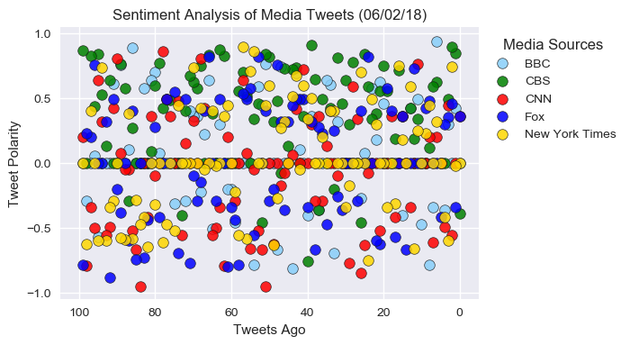
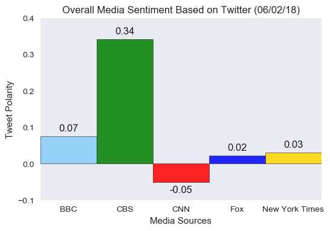

### NewsMood Analysis
- Observed trend 1: A majority of tweets, particularly those from New York Times, are quite neutral.
- Observed trend 2: Twitter sentiment is highly spreaded out, and does not have clear trend over time.
- Observed trend 3: On average, CBS has most positive sentiment, whereas CNN has most negative sentiment, over the past 100 tweets.


```python
# Dependencies
import json
import tweepy
import matplotlib.pyplot as plt
import matplotlib as mpl
import pandas as pd
import numpy as np
import seaborn as sns
import datetime

# Import Twitter API Keys
from config import consumer_key, consumer_secret, access_token, access_token_secret

# Import and Initialize Sentiment Analyzer
from vaderSentiment.vaderSentiment import SentimentIntensityAnalyzer
analyzer = SentimentIntensityAnalyzer()

# Setup Tweepy API Authentication
auth = tweepy.OAuthHandler(consumer_key, consumer_secret)
auth.set_access_token(access_token, access_token_secret)
api = tweepy.API(auth, parser=tweepy.parsers.JSONParser())
```

### Retrieve twitter data from target user accounts


```python
# Target user accounts
target_list = ['BBC', 'CBS', 'CNN', 'Fox', 'New York Times']
target_user_list = ['@BBC', '@CBS', '@CNN', '@FoxNews', '@nytimes']
```


```python
# Preallocate twitter data
twitter_data = {}

# Loop over target user accounts
for target_user in target_user_list:

    # Get 100 tweets by the user
    public_tweets = api.user_timeline(target_user, count=100, result_type="recent")
    
    # Store twitter data
    twitter_data[target_user] = public_tweets
```

### Analyze twitter data for sentiment


```python
# Preallocate analysis results
source_acounts = []
texts = []
dates = []
tweets_ago = []
compounds = []
positives = []
neutrals = []
negatives = []

# Analyze twitter data
for target_user, public_tweets in twitter_data.items():
    
    counter = 0
    
    for tweet in public_tweets:
        
        # Retrieve tweet info
        text = tweet['text']
        raw_time = tweet['created_at']
        date = datetime.datetime.strptime(raw_time, "%a %b %d %H:%M:%S %z %Y").date()
        
        # Run sentiment analysis
        results = analyzer.polarity_scores(text)
        compound = results["compound"]
        pos = results["pos"]
        neu = results["neu"]
        neg = results["neg"]

        # Store in list
        source_acounts.append(target_user)
        texts.append(text)
        dates.append(date)
        tweets_ago.append(counter)
        compounds.append(compound)
        positives.append(pos)
        neutrals.append(neu)
        negatives.append(neg)
        
        counter += 1

# Write to dataframe
df = pd.DataFrame({'source account':source_acounts, 'text':texts, 'date':dates, 'tweets ago':tweets_ago,
                  'compound score':compounds, 'positive score': positives, 'neutral score': neutrals,
                  'negative score': negatives})
```


```python
# Format dataframe
df = df[['source account', 'text', 'date', 'tweets ago', 'compound score', 'positive score', 'neutral score',
                  'negative score']]
df.head()
```


<div>
<style scoped>
    .dataframe tbody tr th:only-of-type {
        vertical-align: middle;
    }

    .dataframe tbody tr th {
        vertical-align: top;
    }

    .dataframe thead th {
        text-align: right;
    }
</style>
<table border="1" class="dataframe">
  <thead>
    <tr style="text-align: right;">
      <th></th>
      <th>source account</th>
      <th>text</th>
      <th>date</th>
      <th>tweets ago</th>
      <th>compound score</th>
      <th>positive score</th>
      <th>neutral score</th>
      <th>negative score</th>
    </tr>
  </thead>
  <tbody>
    <tr>
      <th>0</th>
      <td>@BBC</td>
      <td>Women are more likely to wait longer for a hea...</td>
      <td>2018-06-02</td>
      <td>0</td>
      <td>0.0000</td>
      <td>0.000</td>
      <td>1.000</td>
      <td>0.000</td>
    </tr>
    <tr>
      <th>1</th>
      <td>@BBC</td>
      <td>A once-in-a-lifetime conversation with Eileen ...</td>
      <td>2018-06-02</td>
      <td>1</td>
      <td>0.4215</td>
      <td>0.167</td>
      <td>0.833</td>
      <td>0.000</td>
    </tr>
    <tr>
      <th>2</th>
      <td>@BBC</td>
      <td>Not long to go now...⚽️\n\n#HistoryWillBeMade ...</td>
      <td>2018-06-02</td>
      <td>2</td>
      <td>0.0000</td>
      <td>0.000</td>
      <td>1.000</td>
      <td>0.000</td>
    </tr>
    <tr>
      <th>3</th>
      <td>@BBC</td>
      <td>A project to provide free sanitary products to...</td>
      <td>2018-06-02</td>
      <td>3</td>
      <td>0.2960</td>
      <td>0.135</td>
      <td>0.779</td>
      <td>0.086</td>
    </tr>
    <tr>
      <th>4</th>
      <td>@BBC</td>
      <td>🍽️🤣 When you’re too polite to complain. https:...</td>
      <td>2018-06-02</td>
      <td>4</td>
      <td>-0.3612</td>
      <td>0.000</td>
      <td>0.737</td>
      <td>0.263</td>
    </tr>
  </tbody>
</table>
</div>


### Sentiment over time


```python
mpl.rcParams['figure.dpi']= 100
mpl.rcParams['font.family'] = 'sans-serif'
mpl.rcParams['font.sans-serif'] = ['Arial']
sns.set(color_codes=True)
face_colors = ['lightskyblue', 'green', 'red', 'blue', 'gold']
today_date = datetime.date.today().strftime("%m/%d/%y")

for i, label in enumerate(target_list):
    
    # Filter data
    data = df.loc[df['source account']==target_user_list[i]]
    
    # Plot
    sns.regplot(data=data, x="tweets ago", y="compound score", fit_reg=False, label=label,
                scatter_kws={'facecolors': face_colors[i], 'linewidths': 0.5, 'edgecolors': 'k', 's': 70,
                            'alpha': 0.85})


    
plt.yticks(np.arange(-1,1.5,0.5))
plt.xlim((-5, 105))
plt.ylim((-1.05, 1.05))
plt.xlabel('Tweets Ago')
plt.ylabel('Tweet Polarity')
plt.title(f'Sentiment Analysis of Media Tweets ({today_date})')
plt.legend(loc='upper left', frameon=False, markerscale = 1, title='Media Sources', bbox_to_anchor=[1,1])
plt.gca().invert_xaxis()
None
```





### Sentiment of each account


```python
# Group by twitter account
grouper = df.groupby(['source account'])
overall_score = grouper['compound score'].mean()
overall_score
```


    source account
    @BBC        0.074829
    @CBS        0.341700
    @CNN       -0.050156
    @FoxNews    0.022276
    @nytimes    0.029943
    Name: compound score, dtype: float64


```python
plt.bar(overall_score.index, overall_score.values, color = face_colors, 
        linewidth= 0.5, alpha= 0.85, edgecolor= 'k', width= 1)

plt.xticks(target_user_list, target_list)
plt.xlim((-0.5, 4.5))
plt.ylim((-0.1, 0.4))
plt.xlabel('Media Sources')
plt.ylabel('Tweet Polarity')
plt.title(f'Overall Media Sentiment Based on Twitter ({today_date})')
plt.grid(False)
None

# Add text labels
posx = range(len(target_user_list))
posy = (overall_score).values - 0.01 + 0.02 * ((overall_score).values > 0)
va = ['bottom' if (overall_score.loc[account]>0) else 'top' for account in target_user_list]
labels = overall_score.values
for i in range(len(target_user_list)):
    plt.text(posx[i], posy[i], '%1.2f' % (labels[i]), ha='center', va=va[i], color='k')
```




