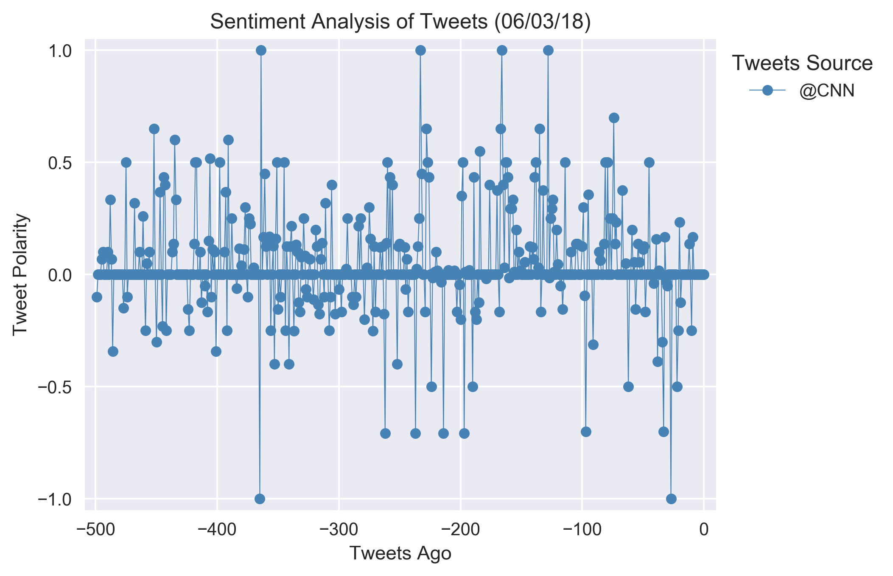
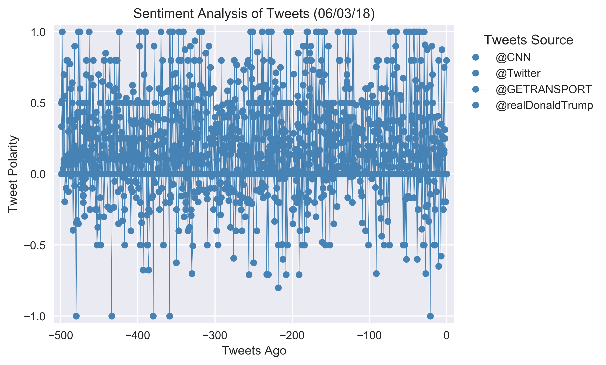
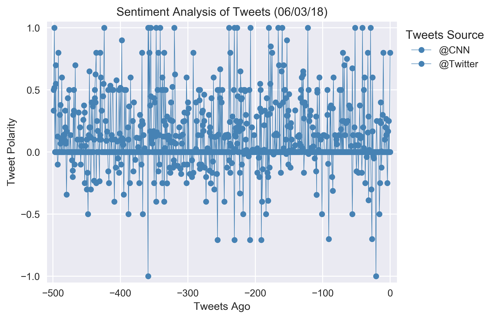

# PlotBot

A bot that sends out visualized sentiment analysis of a Twitter account's recent tweets. The bot receives tweets via mentions and in turn performs sentiment analysis on the most recent twitter account specified in the mention.

For example, when a user tweets, "[@alf7tf](https://twitter.com/alf7tf?lang=en) Analyze: [@CNN](https://twitter.com/CNN)", it will trigger a sentiment analysis on the CNN twitter feed.

A plot from the sentiment analysis is then tweeted to the [@alf7tf](https://twitter.com/alf7tf?lang=en) twitter feed.

Here below are example plots from [@alf7tf](https://twitter.com/alf7tf?lang=en). See twitter account [@alf7tf](https://twitter.com/alf7tf?lang=en) for more.

